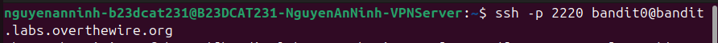
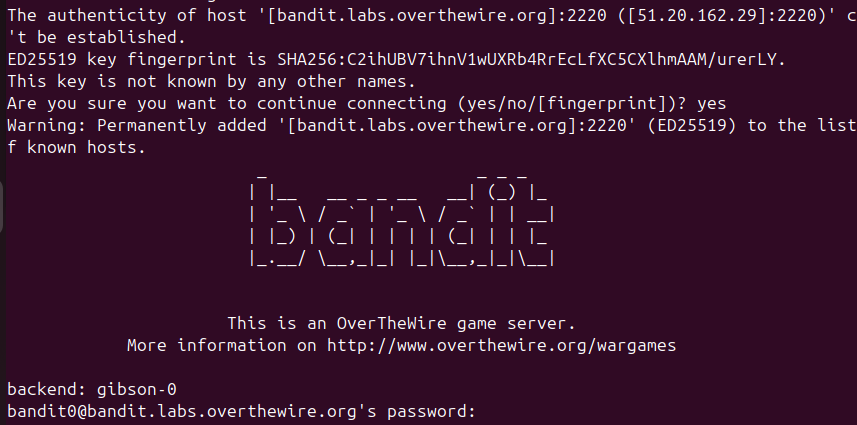

# Level 0

### Cú pháp để ssh

SSH là giao thức mạng cổng 22, giúp kết nối qua mạng internet -p là chỉ định cổng kết nối nếu không kết nối ở cổng 22, ở đây là 2220 bandit0 là username, sau dấu @ là host, ở đây là bandit.labs.overthewire.org

### Output sau khi kết nối ssh

The authenticity of host '[bandit.labs.overthewire.org]:2220 ([51.20.162.29]:2220)' can't be established: Câu này bảo là cái server này chưa được xác minh, và hostname ở đây đã được chuyển thành địa chỉ IP: 51.20.162.29, cổng 2220 -> Lần đầu kết nối vào server sẽ hiện dòng này ED25519 key fingerprint is SHA256:C2ihUBV7ihnV1wUXRb4RrEcLfXC5CXlhmAAM/urerLY. Đây là public key của server được mã hóa SHA256, dùng để so sánh xem mình có kết nối đúng server không This key is not known by any other names: nghĩa là cái key bên trên chưa được client biết bằng tên khác Are you sure you want to continue connecting (yes/no/[fingerprint])? : có đồng ý kết nối không, nếu có thì nhập yes hoặc fingerprint của server, fingerprint khớp thì mới vào được This is an OverTheWire game server. More information on http://www.overthewire.org/wargames: 2 dòng này nói rằng đây là game server của OverTheWire, có thể xem thêm thông tin ở link cung cấp backend: gibson-0: thông tin backend server

bandit0@bandit.labs.overthewire.org's password: dòng này yêu cầu nhập password, ở đây pass là bandit0, nhưng lúc nhập không hiện gì, nhập đúng enter thì vào

### Checlist lv0

- SSH khác telnet ở chỗ và an toàn hơn ở chỗ , ssh khi truyền dữ liệu thì dữ liệu sẽ được mã hóa còn telnet thì không. Telnet không có host key fingerprint để nhận diện server như ssh, telnet cũng không có cơ chế public key authentication để xác thực user như ssh. Thêm vào đó, ssh còn có cơ chế xác thực MAC cho dữ liệu được truyền đi để đảm bảo tính toàn vẹn.

- Dòng cảnh báo đó nó hỏi bạn có tin cậy server không, nếu có, khi đăng nhập vào public host key đó sẽ được lưu vào máy mình vì vậy nên lần sau đăng nhập nó sẽ ko cần hỏi nữa mà đem so với key được lưu trong máy.

- Đoạn banner có mục đích là thông báo cho người kết nối. Server nào cũng có bởi vì nó có thể dùng để thông báo thông báo sử dụng hệ thống; cảnh báo truy cập trái phép; thông tin quản trị; thông báo bảo trì; yêu cầu pháp lý trong một số môi trường.

---

[Mục lục](../README.md) · [Level 1 →](level-01.md)
