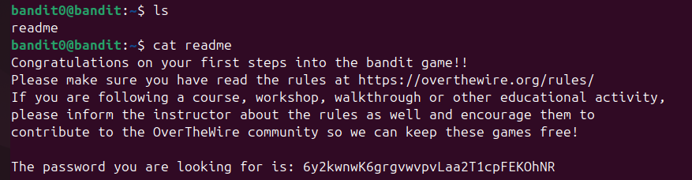
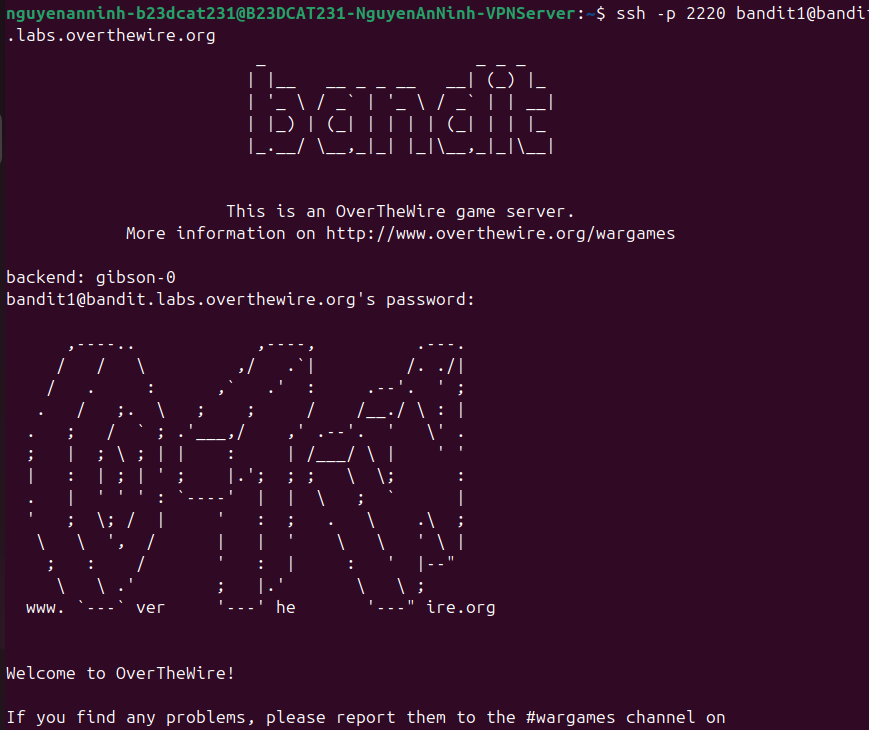

# Level 1

### Hướng giải quyết vấn đề

Sau khi ssh vào server thì ở thư mục home luôn, nên hướng làm sẽ là ls để liệt kê các file hiện có trong thư mục và nếu thấy file readme cần tìm thì dùng cat để đọc nội dung

### Quá trình làm

Sau khi sử dụng lệnh ls thì output liệt kê các file trong thư mục hiện tại, ở đây ta thấy file readme Sau đó dùng lệnh cat + tên file để đọc nội dung trong file, ở đây ta thấy output là nội dung file gồm lời chúc và nhắc nhở thêm từ tác giả, dòng cuối là password: 6y2kwnwK6grgvwvpvLaa2T1cpFEKOhNR

Login thành công vào level 1 với tài khoản là bandit1 và mk đã được cung cấp

---

[← Level 0](level-00.md) · [Mục lục](../README.md) · [Level 2 →](level-02.md)
