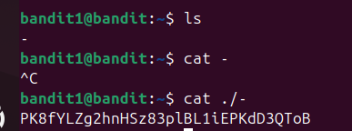
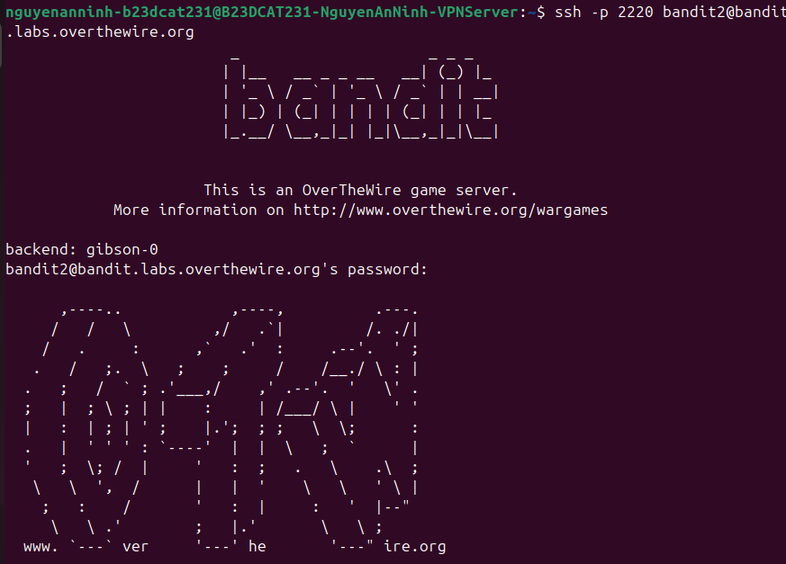

# Level 2

### Hướng giải quyết

Ở đây tên file chứa password là - , vì đây là kí tự đặc biệt nên em nghĩ lệnh cat sẽ không nhận diện là tên file, có thể thử cách dùng lệnh cat + đường dẫn tới file đó, ở đây sẽ là cat ./-

### Quá trình làm

Đầu tiên lệnh ls ra tên file là - như đề bài nói Ở lệnh thứ 2, em dùng thử cú pháp cat + tên file và không được nên bấm Ctrl C để hủy lệnh Sau đó dùng lệnh cat + đường dẫn file như ở hướng giải quyết và đọc được password là: PK8fYLZg2hnHSz83plBL1iEPKdD3QToB

Đăng nhập với tài khoản là bandit2 và thành công

---

[← Level 1](level-01.md) · [Mục lục](../README.md) · [Level 3 →](level-03.md)
