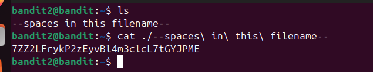
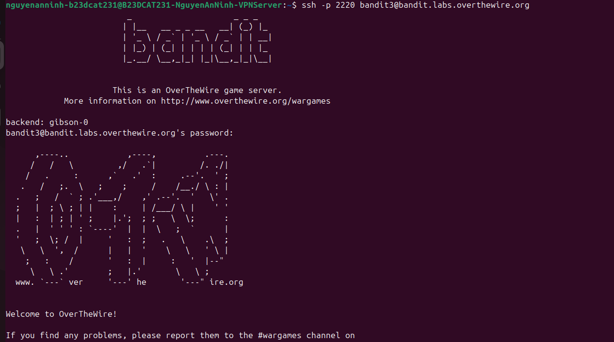

# Level 3

### Hướng giải quyết

Đề bài nói rằng tên file là --spaces in this file name-- ở thư mục home nên chắc chắn dùng lệnh cat + filename thông thường sẽ không được vì có thể cat sẽ nhận – là một option, nên ta sẽ xử lí giống level 2 là dùng đường dẫn ./filename. Còn để xử lí các khoảng trống trong tên file, ta dùng dấu escape khoảng trắng “\”, nó sẽ coi khoảng trắng ở phía sau là một phần của tên file. Bởi nếu bình thường thì tên file sẽ bị coi thành 4 phần riêng biệt nếu có khoảng trắng, ở đây là spaces, in, this, file, name.

### Quá trình làm

Dùng lệnh ls để liệt kê file có trong thư mục, ta nhận được output là tên file: “--spaces in this filename–” Dùng lệnh cat ./--spaces\ in\ this\ filename-- như đã nói và giải thích trong hướng giải quyết, ta được output là password.

Dùng password để ssh với username là bandit3 thành công

> Sau lv2 và lv3, ta thấy cat mặc định hiểu tên file có ký tự đặc biệt:

- dấu gạch ngang ở đầu: - thành option và -- thành long option vì command line có quy ước -x, --help, --version là option - khoảng trắng: bởi vì shell sẽ tách đối số bởi khoảng trắng

### Checklist bổ sung

Cách thứ 2 để đọc được tên file chỉ là dấu - là cat -- - vì -- nghĩa là kết thúc option, những phần phía sau sẽ được coi là tên file. Có 3 cách để xử lí tên file có chứa khoảng trắng: đầu tiên là dùng escape khoảng trắng, thứ 2 là để trong dấu “”, thứ 3 là sử dụng tab completion

---

[← Level 2](level-02.md) · [Mục lục](../README.md) · [Level 4 →](level-04.md)
