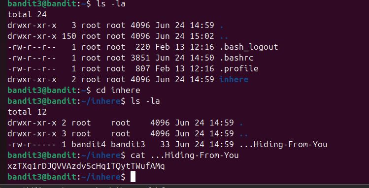
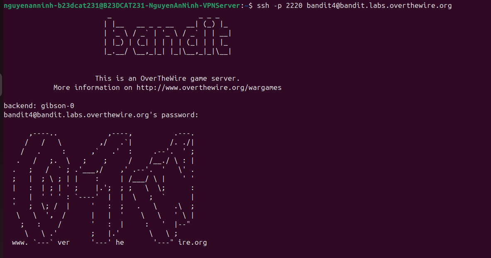

# Level 4

### Hướng giải quyết

Đề bài nói rằng password nằm trong 1 hidden file bên trong inhere directory, nên đầu tiên sử dụng thử lệnh ls để xem các file và thư mục hiện có trong home, nếu thấy inhere thì dùng lệnh cd vào thư mục đó, sau đó dùng lệnh ls -la, với -l là hiện chi tiết các thông tin như loại file, quyền, owner, group, size, ngày sửa, -a là hiện thị tất cả, kể cả file ẩn. Sau đó cat hidden file đó để đọc password.

### Quá trình làm

Dùng lệnh ls -la để list tất cả file kể cả file ẩn có dấu . trước tên và thông tin chi tiết, thấy thư mục inhere với loại là “d” nghĩa là directory- thư mục, nếu là “-” thì là file thường, quyền có dạng rwxr-xr-x, 3 kí tự đầu “rwx” là quyền của owner nghĩa là đọc viết thực thi, 3 cái tiếp theo là của group và tiếp tục là của others, sau hardlink là các số 1,2,3,.. là owner, group ở đây đều là root. Sau đó là size, ngày chỉnh sửa rồi đến tên Dùng lệnh cd inhere để vào thư mục inhere Dùng lệnh ls -la để list tất cả file kể cả file ẩn và thông tin chi tiết, ta thấy file ẩn …Hiding-From-You, các thông tin tương tự như đã giải thích. Dùng lệnh cat + tên file ta nhận được password

Dùng password và username bandit4 đăng nhập thành công.

> Sự khác nhau giữa file ẩn và file thường: file ẩn sẽ bắt đầu bằng dấu chấm, file ẩn chỉ hiện ra khi bạn dùng option -a (all) của lệnh ls vì nó ra lệnh hệ thống hiển thị mọi file giúp hiển thị gọn gàng hơn và tránh xóa nhầm file, file thường thì sẽ lưu dữ liệu, file ẩn lưu các config.

### Checklist bổ sung

File ẩn không an toàn hơn file thường, bởi vì file ẩn chỉ làm nó ít xuất hiện hơn, muốn xuất hiện thì cần option -a, độ an toàn dựa vào nhiều yếu tố như quyền, mã hóa,...

---

[← Level 3](level-03.md) · [Mục lục](../README.md) · [Level 5 →](level-05.md)
