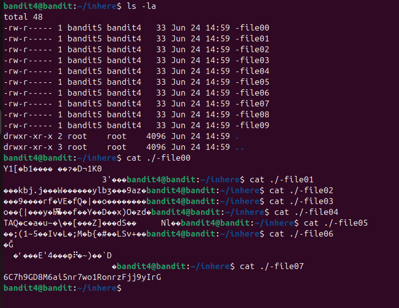
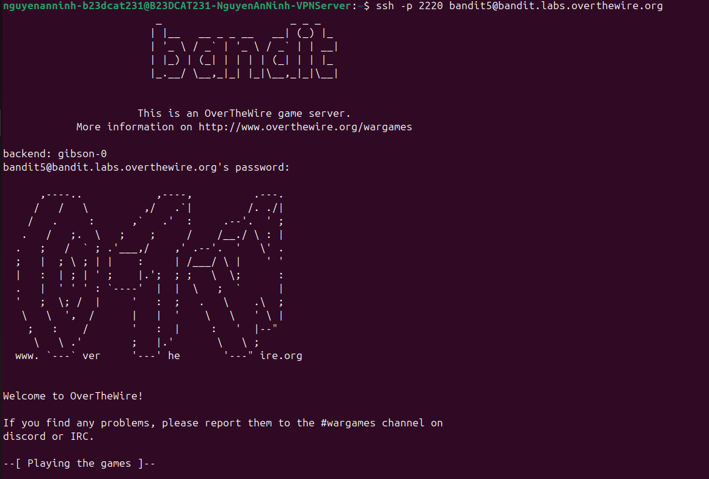
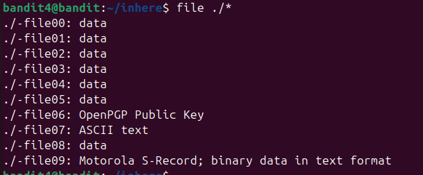

# Level 5

### Hướng giải quyết

Tiếp tục cd vào thư mục inhere, dùng lệnh ls -la để liệt kê các file, vì ở đây đề bảo password được lưu ở file có nội dung chỉ có con người đọc được, nên sẽ thử bruteforce đọc tất cả các file có trong thư mục để tìm nội dung có thể đọc được

### Cách làm

dùng ls -la thấy 10 file có dạng -file00…09 lần lượt cat từng file một, vì tên file bắt đầu là - nên phải có dạng đường dẫn. Ở đây nội dung các file từ 0 đến 6 đều có dạng không đọc được(binary data) và ở file 07 dễ thấy đọc được -> đây là password

Đăng nhập thử với username bandit5 và mk mới tìm được thành công

> ở đây có thể dùng lệnh file để xem kiểu file (dựa vào magic number)

Lệnh file ./* với * là kí tự đại diện, nó giúp mình viết 1 mẫu tên, sau dấu * đó là các tên file bất kì, miễn là ở trước dấu * nó đã khớp Output ta thấy từ 00->05 là data, 06 là public key, 07 là ascii text có thể đọc được như ta đã tìm thấy, 08 là data, 09 là binary data in text format.

> Human readable file là file mà dữ liệu mở ra bằng cat là các từ có nghĩa, đọc được, ở

dạng text. Binary là dữ liệu kiểu nhị phân, nó có thể đổi thành các kí tự hoặc nếu không thì sẽ có dạng kí tự hình thoi có dấu hỏi chấm bên trong.

### Checklist bổ sung

-File biết một file là text hoặc binary bằng cách kiểm tra magic bytes, header của nó, chứ không hề mở ra đọc thử như con người -Để chạy lệnh file cho nhiều file cùng lúc ta có thể truyền nhiều tên file vào cùng 1 lệnh hoặc dùng * để khớp các kí tự.

---

[← Level 4](level-04.md) · [Mục lục](../README.md) · [Level 6 →](level-06.md)
