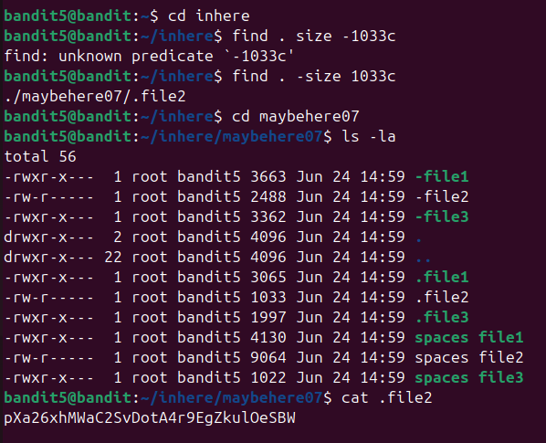
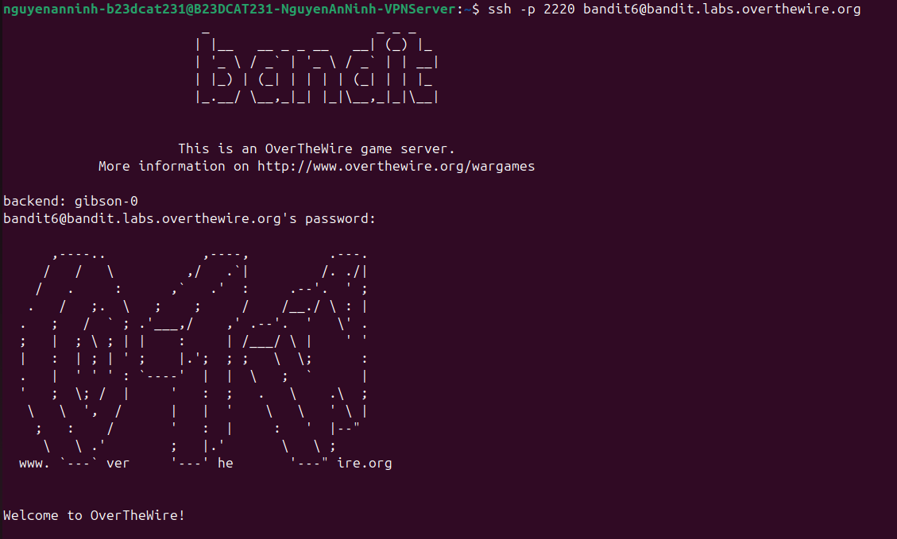

# Level 6

### Hướng giải quyết

Đề bài nói rằng file chứa password nằm dưới thư mục inhere và cho các thông số của file đó vì vậy nên em sẽ hướng tới việc dùng hàm find, đầu tiên là find theo size, rồi xem có bao nhiêu file, rồi mình sẽ dùng lệnh file để lọc ra các file readable, rồi từ đó check các file thỏa mãn xem file nào không có quyền execute, nếu thỏa mãn tất cả thì cat nội dung file và lấy password Quá trình làm: (dau ~)

Dùng lệnh cd inhere để vào thư mục inhere Dùng câu lệnh find với cú pháp find . -size 1033c ở đây “.” nghĩa là tìm từ thư mục hiện tại, -size nghĩa là chọn option tìm theo size, 1033c ở đây nghĩa là lớn 1033 bytes (c là byte, k là KiB, M là MiB, G là GiB). Output nghĩa là đã tìm được 1 file thỏa mãn nằm trong thư mục maybehere07 bên trong thư mục inhere, file tên “.file2”. Dùng lệnh cd maybehere07 để vào thư mục maybehere07 Dùng thêm lệnh ls -la để xem các quyền của file, ở đây ta thấy file .file2 không có quyền execute đúng như đề bài nói Dùng lệnh cat để đọc file và có password

ssh vào lv6 với username bandit6 và mk vừa có và thành công

---

[← Level 5](level-05.md) · [Mục lục](../README.md) · [Level 7 →](level-07.md)
