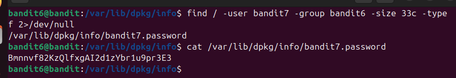
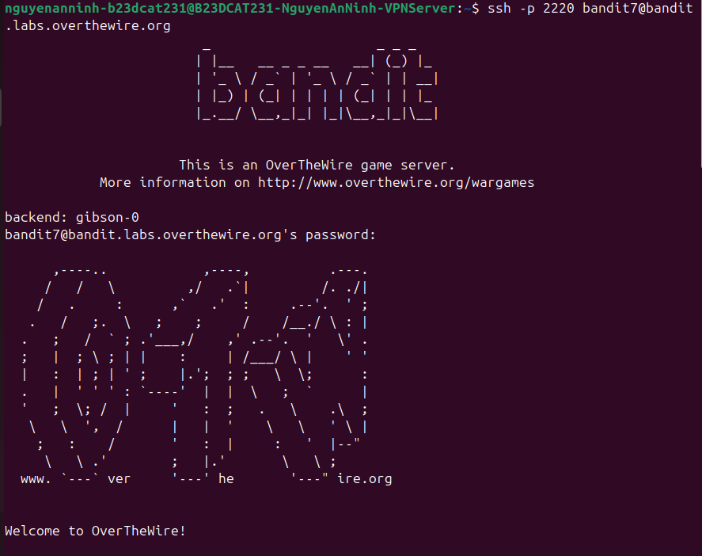

# Level 7

### Hướng làm bài

Đầu tiên dùng câu lệnh find . -user bandit7 -group bandit6 -size 33c và không thấy kết quả

> chỉ tìm ở thư mục hiện tại trở đi nên có thể không thấy. Chuyển sang hướng mới là tìm từ thư mục gốc find /. -user bandit7 -group bandit6 -size 33c

> output ra rất nhiều file và thư mục với permission denied Thêm option -type f để lọc file và 2>/dev/null(tim hieu them) để bỏ qua các file bị permission denied

### Cách làm bài

Câu lệnh find / -user bandit7 -group bandit6 -size 33c -type f 2>/dev/null: “/” nghĩa là tìm từ root, option -user là bandit7 như đề gợi ý, -group là bandit6, option size 33 byte, -type f để lọc các file, 2>/dev/null để ẩn các file bị permission denied. Output nhận được là 1 file tên “bandit7.password” với đường dẫn /var/lib/dpkg/info. Dùng thẳng câu lệnh cat + đường dẫn đến file đó để đọc file. Output nhận được là password

Đăng nhập thành công với password tìm được và username bandit7.

> Lệnh find có thể dùng để lọc theo các điều kiện: tên (-name), kích thước(-size), kiểu (-type), người sở hữu(-user), theo nhóm (-group), theo quyền (-perm) với cú pháp kiểu -perm 644, 3 số lần lượt cho các quyền của owner, group, others, read là 4, write là 2, execute là 1

### Checklist bổ sung tuần 1

---

[← Level 6](level-06.md) · [Mục lục](../README.md) · [Level 8 →](level-08.md)
