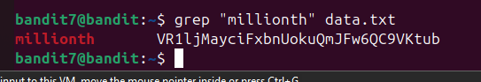
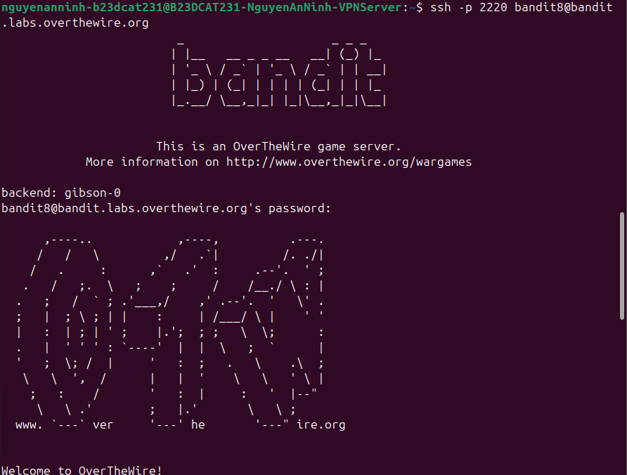

# Level 8

### Hướng làm bài

Dùng lệnh grep để tìm dòng có chữ millionth trong file data.txt

### Quá trình làm

Lệnh grep dùng để tìm dòng chứa một chuỗi kí tự gì đó, cú pháp có dạng grep options cú pháp tên file cần tìm. Ở đây là tìm các dòng có chứa chuỗi “millionth” trong file data.txt Ouput ta thấy pattern khớp được in đỏ và cùng dòng với nó là password

Đăng nhập thành công vào level 8 với username bandit8 và password vừa tìm được.

> Phân biệt 3 lệnh grep, sort và uniq: -grep dùng để tìm theo nội dung -sort dùng để sắp xếp nội dung -uniq dùng để loại bỏ trùng lặp grep sẽ dùng trong bài toán tìm nội dung khi biết chuỗi cần tìm sort dùng trong bài toán sắp xếp các chuỗi giống nhau lại gần nhau, đếm số lượng các chuỗi giống nhau uniq dùng để cho các dòng giống nhau liền kề nhau thành 1 dòng -> thường sẽ sort xong với uniq, uniq có thể dùng để đếm số lần xuất hiện bằng option -c.

> bash và zsh đều là shell, nhưng zsh được sử dụng bên kali nhiều hơn, bash thì thường được sử dụng ở ubuntu/linux server. bashrc là file chứa cấu hình shell, có thể dùng để tạo bí danh, tùy chỉnh giao diện terminal,... Tương tự với zshrc. File .profile để lưu các thiết lập của người dùng trong phiên đăng nhập

> Khi đăng nhập vào hệ thống, quy trình là đầu tiên sshd là service của ssh, được khởi động bởi systemd khi mở máy, nó sẽ đợi client kết nối. Khi ssh vào, sshd nhận kết nối và xác thực bằng password hoặc sshkey thông qua PAM (PAM là 1 lớp xác thực chung). Sau khi xác thực xong, hệ thống tạo session cho user và chạy shell được khai báo trong /etc/passwd như bash hoặc zsh. Sau đó shell đọc các cấu hình như .profile, .bashrc, .bashlogin để thiết lập môi trường.

---

[← Level 7](level-07.md) · [Mục lục](../README.md) · [Level 9 →](level-09.md)
