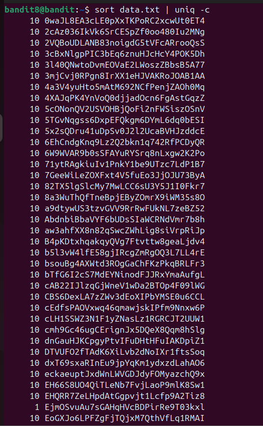
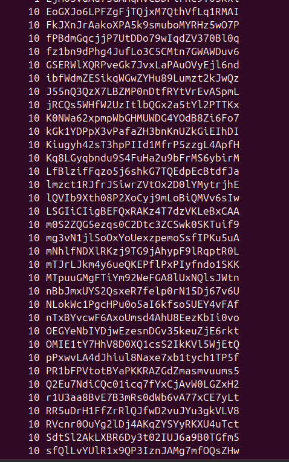
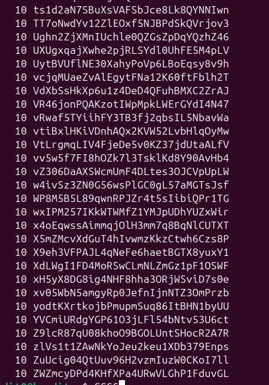
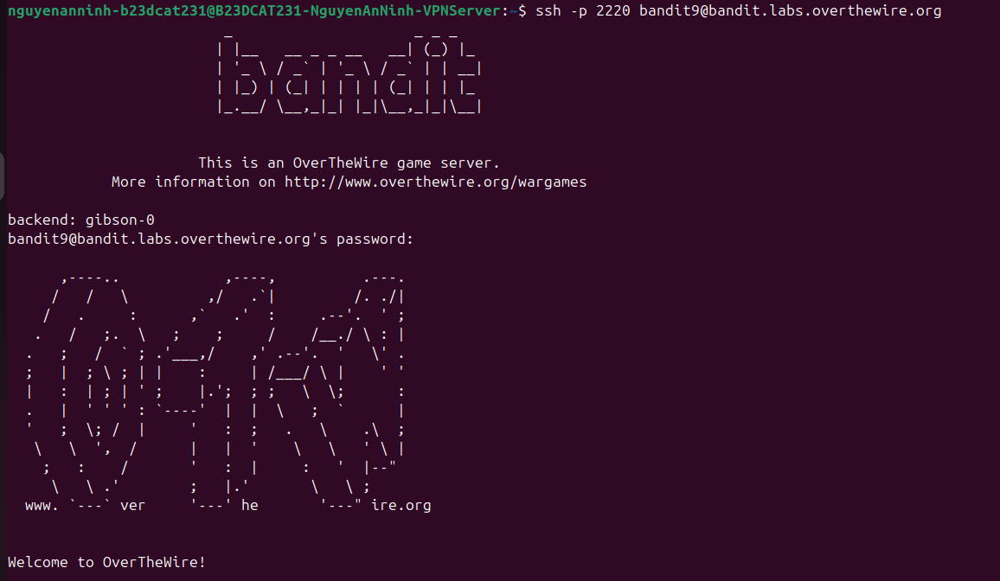

# Level 9

### Hướng giải quyết

Vì đề bài bảo password nằm trong file data.txt và là dòng chỉ xuất hiện đúng 1 lần nên sẽ dùng lệnh sort data.txt | uniq -c

### Cách làm bài

Lệnh sort data.txt | uniq -c ở đây nghĩa là sort data.txt nghĩa là xếp những dòng có trùng nội dung lại gần nhau, tiếp theo dùng | ở đây là pipe, nghĩa là lấy output của lệnh trc làm input của lệnh sau, ở đây nó sẽ lấy output của lệnh sort data.txt vào làm input cho uniq -c , lệnh uniq với option -c nghĩa là đếm số lần xuất hiện của các dòng giống nhau làm liên tiếp nhau Ta thấy output ở đây có 1 dòng xuất hiện 1 lần: EjmOSvuAu7sGAHqHVcBDPirRe9T03kxl sẽ là password

Ta đăng nhập thành công Checklist: uniq chỉ tính các dòng giống nhau khi nó nằm liền kề nhau uniq -c in tất cả các dòng kèm số lần xuất hiện uniq -d chỉ in các dòng bị trùng uniq -u chỉ in các dòng xuất hiện 1 lần

---

[← Level 8](level-08.md) · [Mục lục](../README.md) · [Level 10 →](level-10.md)
