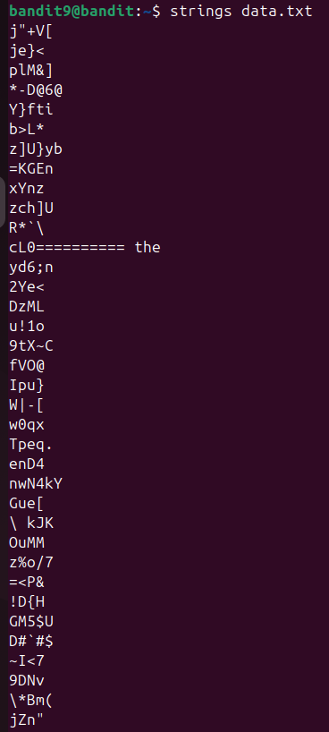
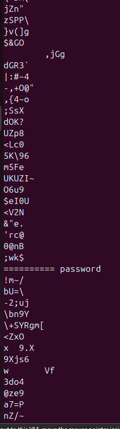
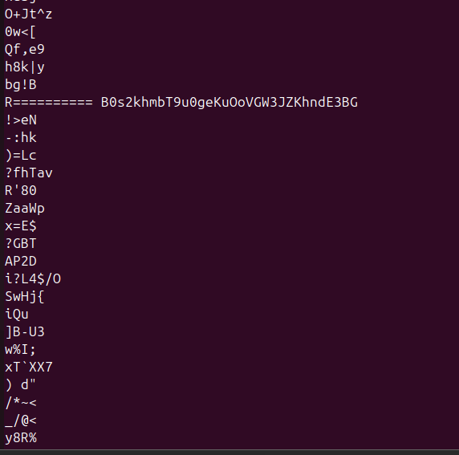
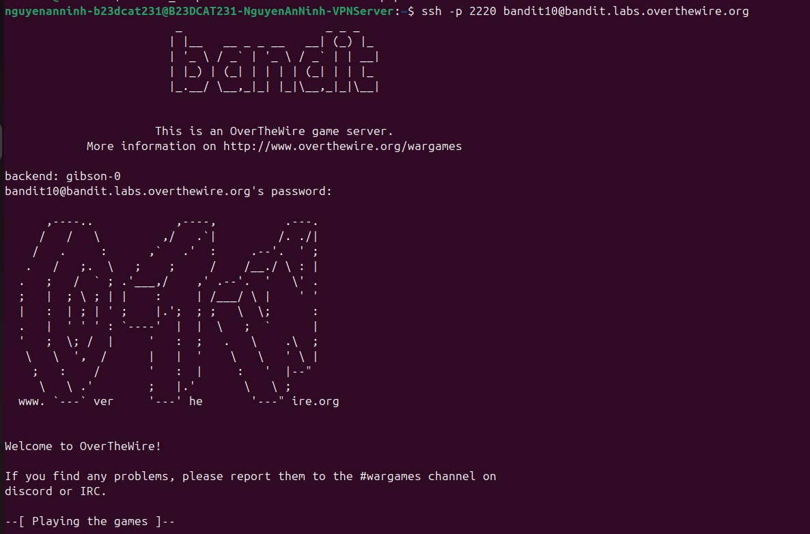

# Level 10

### Hướng làm bài

Dùng lệnh strings + tên file để lọc ra các dòng human readable, rồi tìm dòng nào bắt đầu bằng các kí tự ‘=’ như đề bài nói

### Quá trình làm

Lệnh strings data.txt nghĩa là lọc các dòng human readable trong file, trong ouput ta thấy rất nhiều dòng readable, nhưng chỉ có 1 dòng bắt đầu bằng nhiều kí tự ‘=’ , đây là password: B0s2khmbT9u0geKuOoVGW3JZKhndE3BG

Đăng nhập thành công

---

[← Level 9](level-09.md) · [Mục lục](../README.md) · [Level 11 →](level-11.md)
