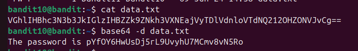
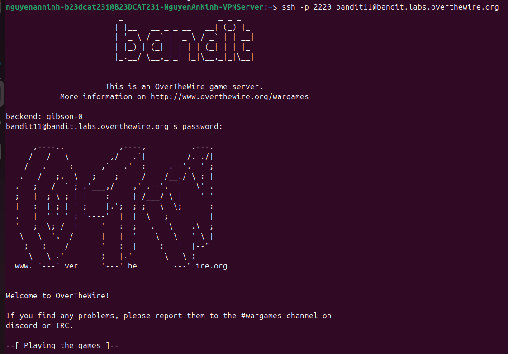

# Level 11

### Hướng làm bài

File chứa password bị mã hóa Base64, dùng lệnh base64 -d + tên file

### Quá trình làm

Lệnh đầu tiên là đọc nội dung file đang được mã hóa, output ra chuỗi mã hóa base64 Lệnh thứ 2 base64 -d data.txt với option -d là decryption, nghĩa là giải mã base64 file data.txt. ta được password Nếu muốn mã hóa base64 thì dùng lệnh base64 + tên file

Đăng nhập thành công

> Base64 là một cơ chế encoding. Nó không dùng để bảo mật, thường ứng dụng trong email (encode các file ảnh, pdf để truyền), biểu diễn dữ liệu nhị phân. Dùng base64 vì dữ liệu trên máy tính có rất nhiều loại: ảnh, file nén, file thực thi,... mà một số giao thức chỉ xử lí dữ liệu dạng text, nên cần thiết phải dùng base64 để truyền được.

---

[← Level 10](level-10.md) · [Mục lục](../README.md) · [Level 12 →](level-12.md)
