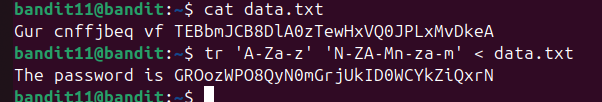
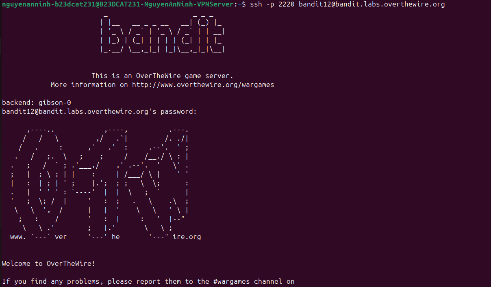

# Level 12

### Hướng làm bài

Đề bài bảo rằng nội dung trong file data.txt bị dịch 13 vị trí, kể cả chữ in hoa và in thường, vì vậy sẽ dùng lệnh tr ‘A-Za-z’ ‘N-ZA-Mn-za-m’ < tên file

### Quá trình làm

Lệnh đầu tiên đọc nội dung file data.txt gốc, ta thấy các chuỗi kí tự được dịch 13 vị trí Lệnh thứ 2 tr ‘A-Za-z’ ‘N-ZA-Mn-za-m’ ở đây ‘A-Za-z’ nghĩa là các chữ cái viết hoa và viết thường ở bảng chữ cái ban đầu, ‘N-ZA-Mn-za-m’ nghĩa là bảng chữ cái sau khi dịch 13 vị trí: N-ZA-M là từ N-Z rồi tiếp tục từ A-M là 1 bảng chữ cái sau khi bị dịch 13 vị trí, tương tự với chữ cái viết thường, ở đây nó sẽ đối chiếu các chữ cái từ bảng chữ cái viết thường ở trong dấu ‘ ‘ đầu tiên để đổi thành các kí tự ở trong bảng chữ cái bị dịch 13 vị trí ở trong dấu ‘ ‘ thứ 2. Kí tự ‘<’ là redirection, nó nghĩa là lấy input là lấy từ file, cụ thể là data.txt. Redirection còn có cả ‘>’ nghĩa là lấy output ở lệnh trc dấu ‘>’ chuyển vào file. Output ở lệnh 2 là password cần tìm

Đăng nhập thành công.

---

[← Level 11](level-11.md) · [Mục lục](../README.md) · [Level 13 →](level-13.md)
