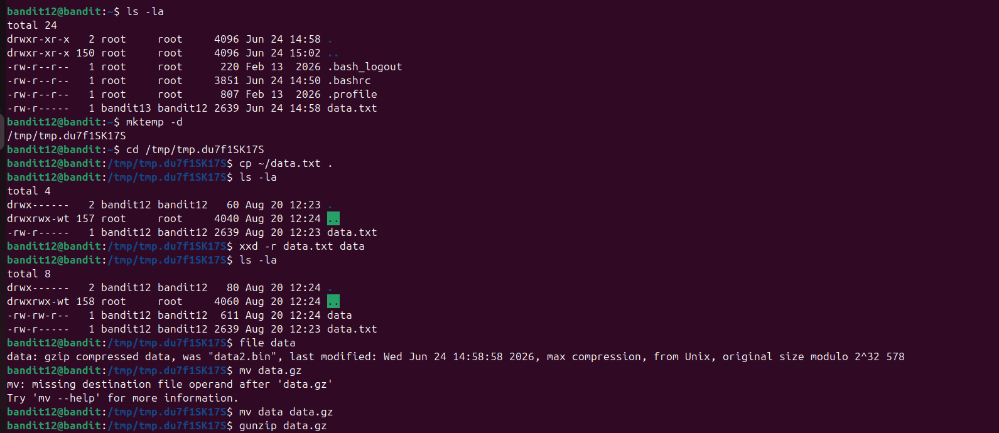
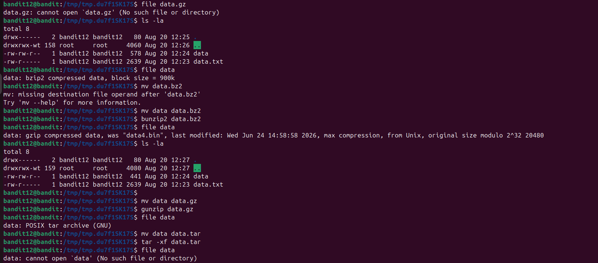
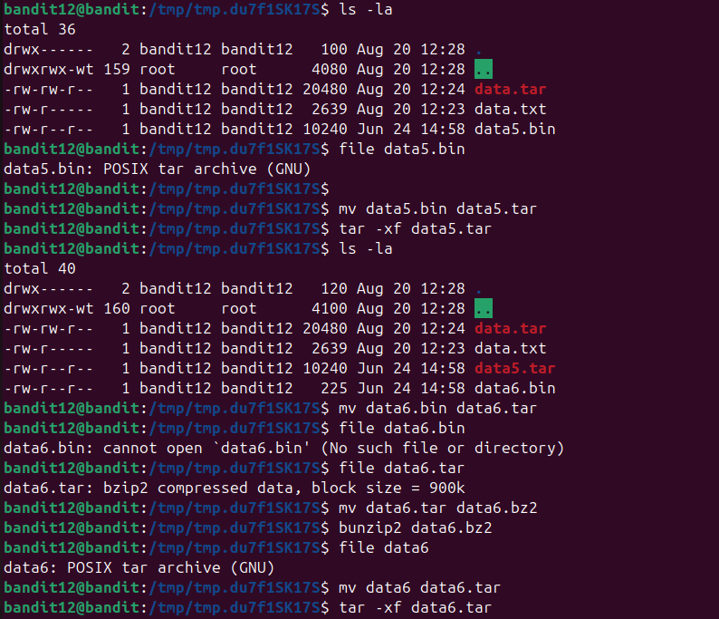
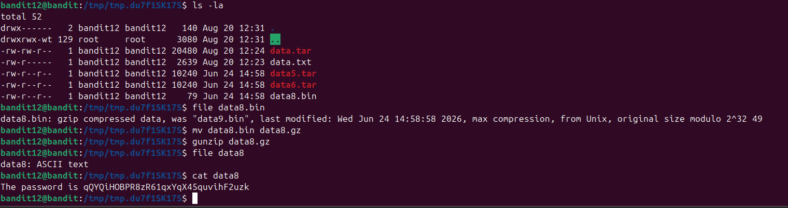
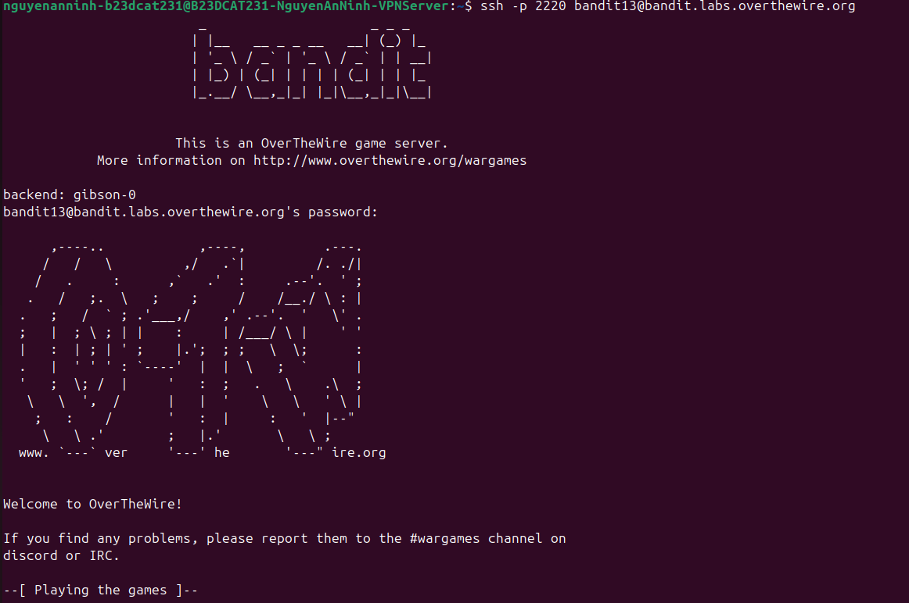

# Level 13

### Hướng làm bài

Tạo 1 thư mục trong thư mục tạm, cp file chứa pass sang thư mục đó, rồi reverse file hexdump về dạng binary bằng lệnh xxd -r + tên file cần rev + tên file mới, sau đó sẽ dùng lệnh file để xác định kiểu file đó là gì (đang bị nén kiểu gì), rồi đổi đuôi file phù hợp với kiểu bị nén của file đó để dễ dàng xử lí (đuôi file không quyết định file đó thuộc dạng file gì, phải sử dụng lệnh file để xác định), sau đó giải nén đúng kiểu cho file đó, rồi tiếp tục lặp lại đến khi giải nén hết các lớp để tìm ra pass.

### Quá trình làm

Lệnh ls -la cho ta thấy trong thư mục home có file data.txt. Lệnh mktemp -d giúp ta tạo 1 thư mục ngẫu nhiên trong thư mục tạm tmp, nếu không có option -d thì sẽ tạo 1 file tạm, ở đây ta tạo 1 folder tạm để việc xử lí các file mới khi bị giải nén ra dễ dàng hơn, không bị loạn. Output là đường dẫn của thư mục tạm vừa được tạo. Lệnh cd + đường dẫn thư mục tạm vừa được tạo để di chuyển vào thư mục đó. Lệnh cp ~/data.txt . với ~ là thư mục home, . là thư mục hiện tại, ở đây nghĩa là cp file data.txt trong thư mục home sang thư mục này và giữ nguyên tên file. (Nếu ta sử dụng tham số thứ 2 là tên file thì nội dung sẽ được cp sang file đó). Lệnh ls -la cho ta thấy trong thư mục hiện tại file data.txt đã được cp sang. Lệnh xxd -r data.txt data ở đây xxd là lệnh để chuyển file sang dạng hexdump, nhưng với option -r (reverse) thì là ngược lại, chuyển từ hexdump về dạng binary, ở đây tham số đầu tiên là file cần rev (data.txt), tham số thứ 2 là file chứa nội dung được rev sang binary. Lệnh ls -la cho ta thấy file data đã xuất hiện Lệnh file data để xác định kiểu file của file data. Output ta thấy file được nén bằng gzip, “was data2.bin” nói rằng trước khi bị nén thì tên file gốc là “data2.bin”, có thời gian lần cuối được chỉnh sửa, “from Unix” là file này được nén trên Unix, kích thước file trước khi nén là 578 bytes.

Lệnh mv data.gz là 1 lệnh lỗi, vì không có tên des file (output báo). Sửa lại với lệnh mv data data.gz, nghĩa là đổi tên file data thành data.gz. Lệnh mv nếu đích là đường dẫn thư mục thì là di chuyển, nếu đích là tên file là đổi tên, nếu đích là đường dẫn + tên file thì là vừa di chuyển vừa đổi tên. Lệnh gunzip data.gz để unzip file bị nén gzip.

Ở đây dùng lệnh file data.gz để check kiểu file, nhưng output báo file hoặc thư mục không tồn tại. Dùng lệnh ls -la để kiểm tra các file có trong thư mục. Ta thấy output xuất hiện file data (không phải là data2.bin như trước khi nó bị nén vì đấy là tên cũ được lưu trong metadata của file nén, khi giải nén tên file mới xuất hiện sẽ dựa vào tên file được giải nén). Dùng lệnh file data để check kiểu file sau khi được giải nén, ta thấy ouput là bzip2, nghĩa là file bị nén bằng bzip2, block size = 900k nghĩa là khi nén, bzip2 chia kích thước file thành các block với kích thước 900kB để nén từng block. Lệnh mv để đổi tên file (dính lỗi tương tự lần trước). Sửa lại lệnh mv với thêm tham số đằng sau, đổi tên file từ data thành data.bz2 Lệnh bunzip2 + tên file để giải nén bzip2 Tương tự dùng lệnh file data để xem kiểu file sau khi giải nén ra là gì. Output ta thấy là gzip, tên file trước khi nén là data4.bin, kích cỡ trước khi nén là 20480 bytes. Xử lí tương tự với file gzip, dùng lệnh file sau khi giải nén ra file mới, ta thấy ouput chỉ ra đây là file được nén bằng tar. Đổi tên file sang đuôi .tar Sử dụng lệnh tar -xf + tên file để giải nén với option x là extract, f là file, nghĩa là giải nén file.

Sử dụng lệnh file data để xem kiểu file, ở đây output báo không tồn tại file hoặc thư mục.

Dùng lệnh ls -la để kiểm tra file sau khi được giải nén tên là gì. Ở đây ta thấy là data5.bin. Tên file sau khi giải nén bị đổi đi khác hẳn là vì tar ở đây là 1 dạng archive nó sẽ gom tất cả các file, thư mục thành 1 file duy nhất, vì vậy khi giải nén nó phục hồi lại các file, thư mục bên trong chứ không như bzip2, gzip. Dùng lệnh file data5.bin để check kiểu file. Ta thấy output báo đây là tar Ta xử lí tương tự, giải nén ra được file data6.bin Ở đây không check loại file mà đã đổi tên, sau đó lại dùng lệnh file với tên cũ (Lỗi). Sử dụng lệnh file data6.tar để check kiểu file. Output ta thấy được nén bởi bzip2, blocksize 900k Xử lí tương tự, ta được file data6. Dùng lệnh file check kiểu dữ liệu, ta thấy được nén bởi tar. Xử lí tương tự, ta được file data8.bin.

Dùng lệnh file lại thấy data8.bin nén bởi gzip. Xử lí tương tự ta được file data8. Dùng lệnh file thấy đây là file ascii text -> kết quả Dùng lệnh cat + tên file để đọc nội dung, thu được password.

Đăng nhập thành công

> base64,rot13,hex ở đây đều là encoding, nghĩa là đổi cách biểu diễn dữ liệu, nó không dùng để bảo mật như encrypt, không cần khóa để mã hóa và giải mã như encrypt và ai biết kiểu encoding của dữ liệu đó đều có thể giải ngược ra dữ liệu gốc.

> khi gặp 1 file lạ dùng lệnh file + tên file đó để biết nó ở định dạng gì.

> các options của tar: -c: tạo file archive mới, -x extract, -t list nội dung trong archive, -f chỉ định tên file, -v hiện các file đang được xử lí, -z dùng gzip, -j dùng bzip2,...

---

[← Level 12](level-12.md) · [Mục lục](../README.md) · [Level 14 →](level-14.md)
