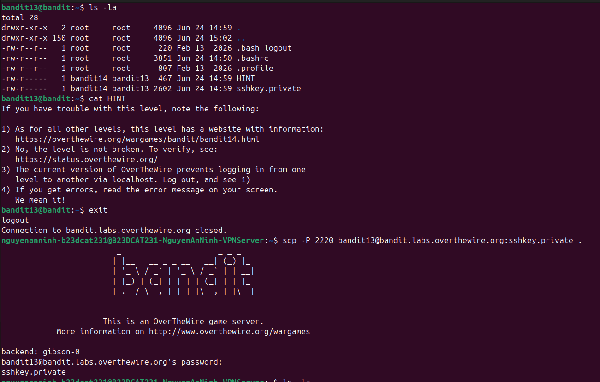
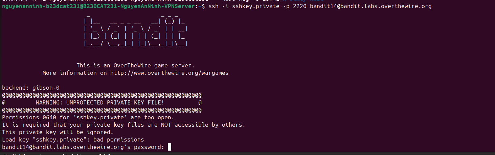
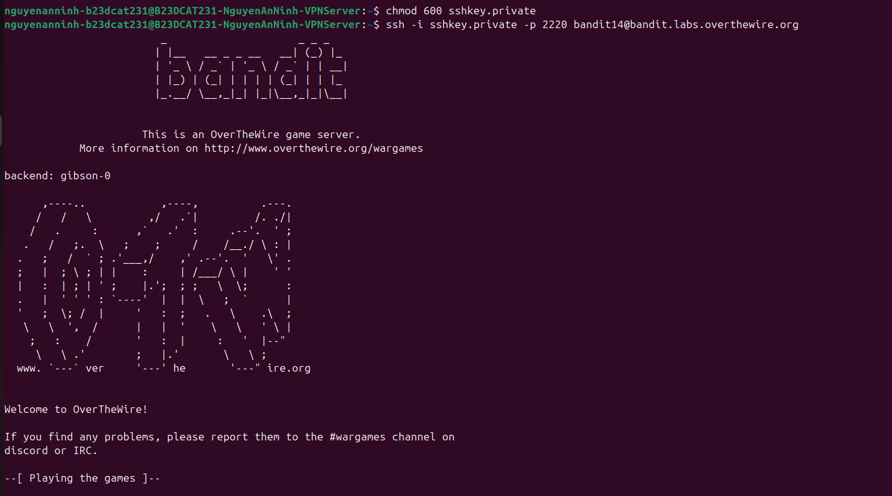
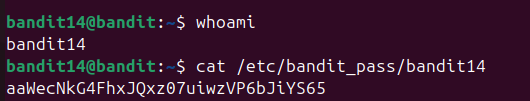
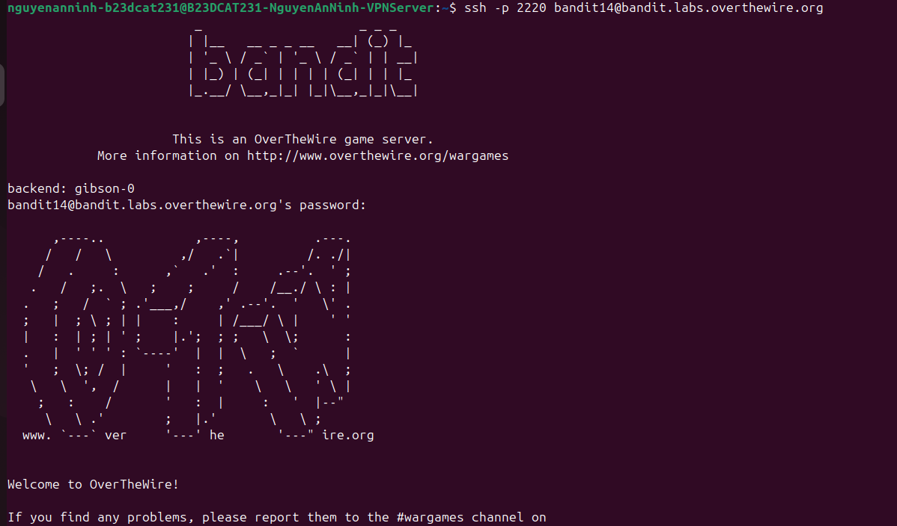

# Level 14

### Hướng làm bài

Đề bài bảo rằng không có pass cho level tiếp theo, mà phải dùng sshkey nên sẽ scp file sshkey về máy để đăng nhập vào level tiếp theo bằng sshkey.

### Quá trình làm

Dùng lệnh ls -la để xem các file có trong thư mục home. Output ta thấy có 2 file HINT và sshkey.private. Dùng lệnh cat để đọc nội dung file HINT, ta thấy 2 thông tin quan trọng: phiên bản hiện tại của OTW không cho đăng nhập từ level này qua level khác qua localhost, nghĩa là phải exit ra, về máy mình để đăng nhập qua level mới và bảo rằng đọc kĩ thông báo lỗi khi gặp lỗi. Dùng lệnh exit để quay về máy mình. Dùng lệnh scp để copy file qua ssh với option -P là port (2220, ở đây -P viết hoa), username@ tên host, sau dấu hai chấm là tên file cần chuyển, “.” nghĩa là chuyển vào thư mục hiện tại ở máy mình. Sau đó phải nhập password, output hiện ra tên file nghĩa là copy file thành công.

Dùng ls -la để kiểm tra thấy file đã có trong máy.

Dùng lệnh ssh với key có được bằng option -i (identity file), nghĩa là chỉ ra file dùng để đăng nhập thay cho việc nhập password. Output ta thấy báo private key file không được bảo vệ, quyền của file đang không an toàn (0640), 0 ở đầu nghĩa là perm được viết dưới dạng bát phân, ở đây groups đang có quyền đọc nên không an toàn và key không được sử dụng.

Đổi quyền cho file bằng lệnh chmod 600 + tên file, 600 ở đây là chỉ có owner có quyền đọc và ghi, groups, others không có quyền gì. Thực hiện ssh lại đã thành công.

Dùng lệnh whoami để biết mình đang sử dụng user gì. Output là bandit14, vậy là sẽ có quyền đọc file password theo đường dẫn đề cho.

Dùng lệnh cat với đường dẫn file chứa password để đọc nội dung file, nhận được password.

Đăng nhập thành công.

> SSH đăng nhập bằng key an toàn hơn đăng nhập bằng pass vì key thường dài hơn, khó bruteforce, độ an toàn phụ thuộc vào việc mình quản lí khóa bí mật. Khi đăng nhập bằng pass, server sẽ kiểm tra pass mình nhập có trùng khớp không, còn khi đăng nhập bằng private key, một chữ kí số sẽ được tạo ra bởi private key, rồi sv sẽ kiểm tra nó bằng public key xem có đúng không, private key không hề rời khỏi máy mình.

---

[← Level 13](level-13.md) · [Mục lục](../README.md) · [Level 15 →](level-15.md)
