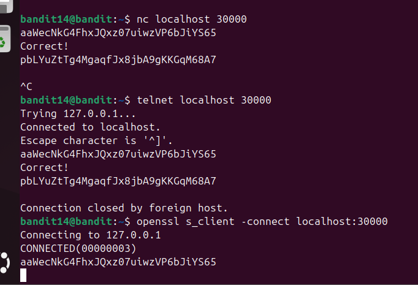

# Level 15

### Hướng làm bài

Sử dụng telnet, nc hoặc openssl để kết nối vào port 30000 trên localhost và nhập password level hiện tại để lấy pass level tiếp theo.

### Cách làm bài

Lệnh nc ở đây là netcat, đây là công cụ để tạo kết nối mạng và nhận dữ liệu. Ở đây, ta kết nc đến port 30000 ở localhost rồi nhập password lv14 nhận được pass lv15 Lệnh telnet là một giao thức để mở kết nối TCP tới port hoặc để đăng nhập từ xa. Ở đây nhập pass lv14 cũng nhận đc passlv15 Lệnh openssl ở đây chạy chế độ sslclient, chọn option -connect để kết nối tới port 30000 localhost, openssl có TLS, vì vậy có thể ở bài này localhost ko sử dụng TLS nên không trả về kết quả.

> các port thông dụng 22:ssh, 443:https, 80:http, 3306:mysql. Phải mở port để nhận kết nối từ client, nó giúp hđh biết dữ liệu phải chuyển tới đâu, không nên mở quá nhiều port vì nó sẽ tăng khả năng bị tấn công.

> Khi kết nối thì client sẽ tự tạo 1 port tạm ở các vùng port cao để tạo ra source port kết nối đến server, như thế thì server mới phân biệt được client

---

[← Level 14](level-14.md) · [Mục lục](../README.md) · [Level 16 →](level-16.md)
