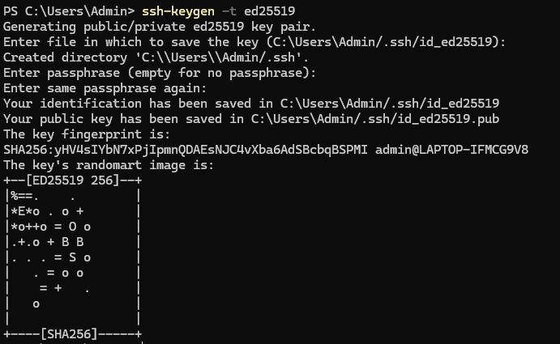
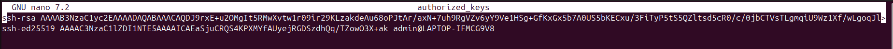
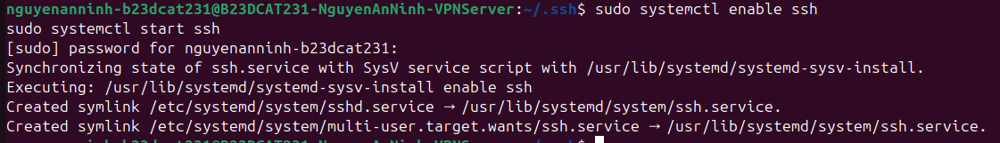
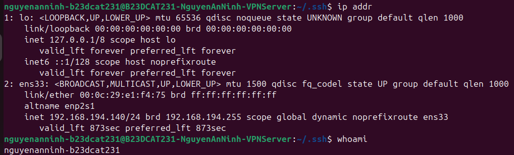
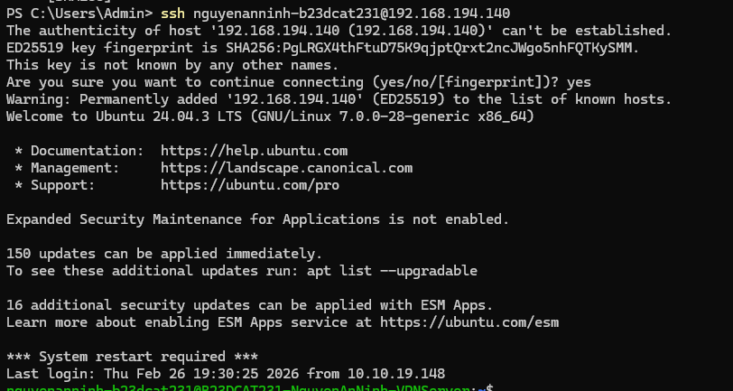
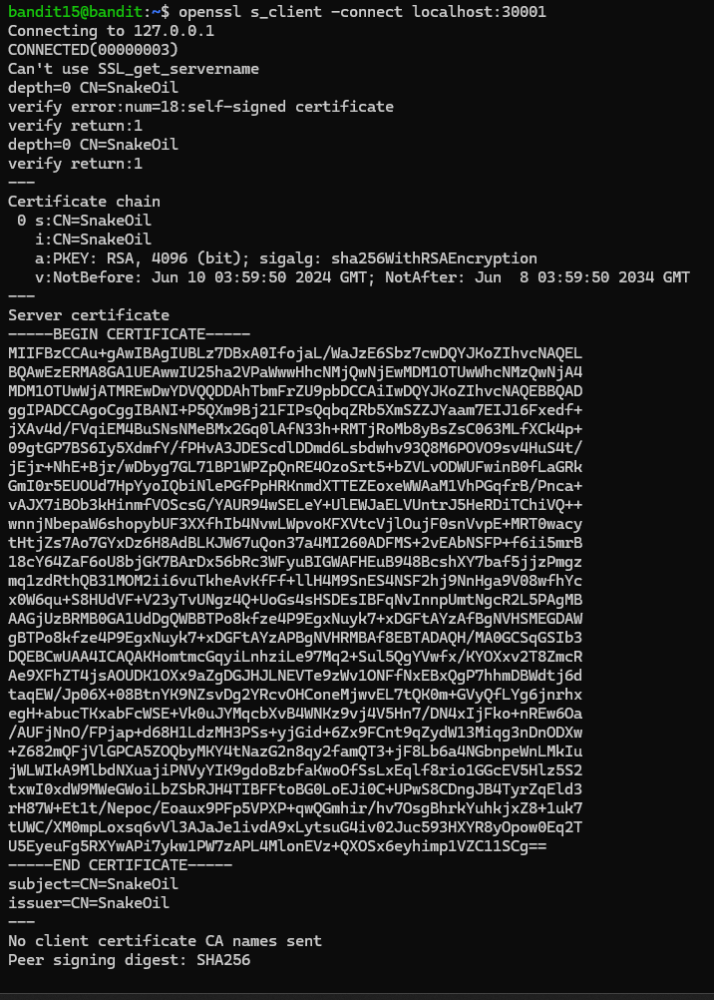
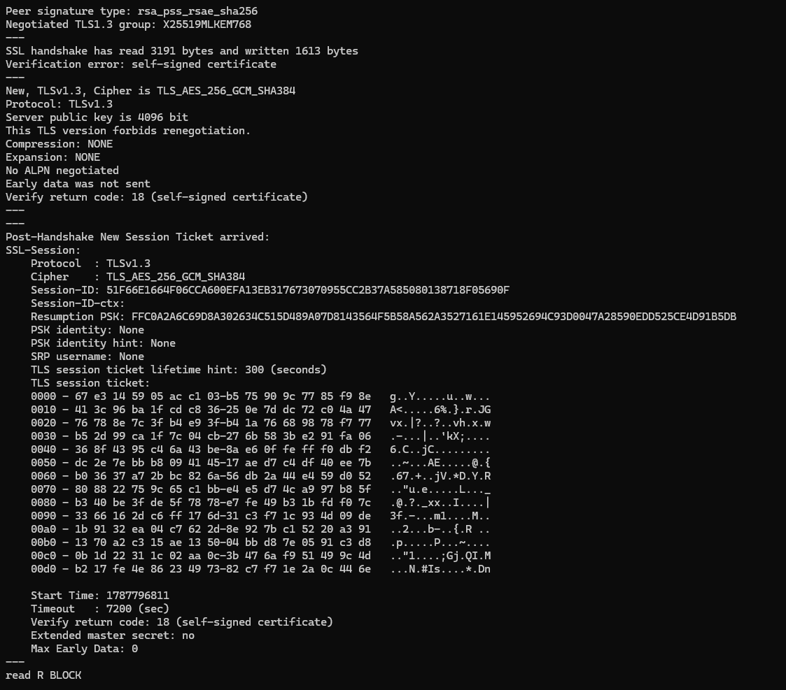
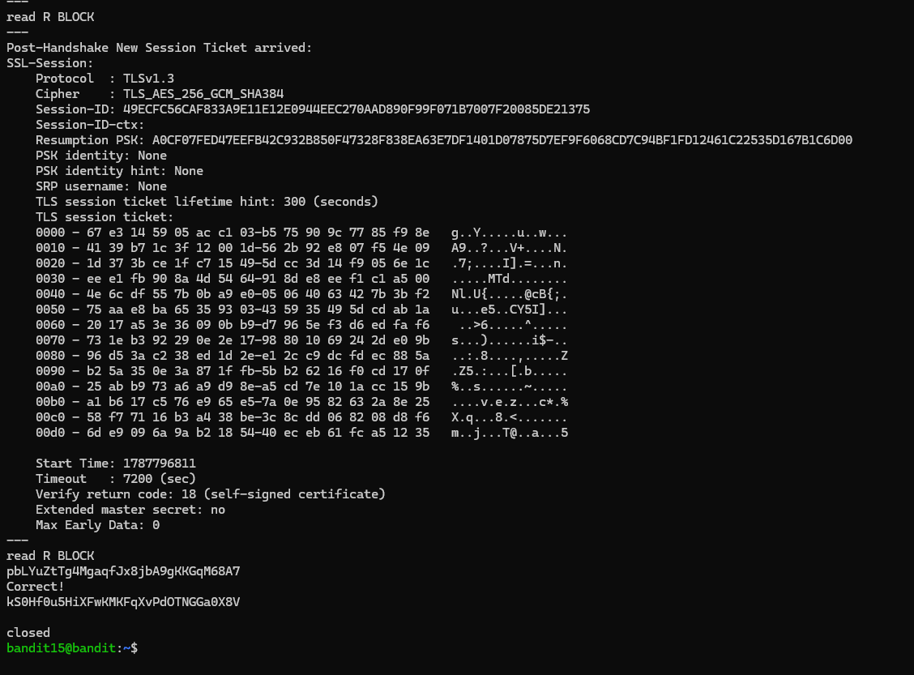

# Level 16

### Hướng làm bài

Đầu tiên, tạo 1 cặp ssh key ở máy windows, lưu public key vào máy kali ở trong file authorized_keys ở trong folder .ssh, rồi dùng ssh vào máy kali để dùng openssl kết nối vào port 30001 để gửi password lấy mk cho level tiếp theo.

### Quá trình làm

Đây là lệnh tạo 1 cặp key để ssh, -t là option chọn loại key (type), ở đây là ed25519, đây là một key hện đại, bảo mật tốt thường được sử dụng thay cho RSA. Dòng output đầu tiên là thông báo đang tạo ra cặp khóa ed25519 Dòng output thứ 2 là chọn đường dẫn để lưu key, ở đây mặc định là C:\Users\Admin/.ssh/id_ed25519, bấm enter để mặc định chọn. Dòng output thứ 3 là file .ssh chưa tồn tại nên nó tạo file đó ở đường dẫn được hiện. Dòng tiếp theo yêu cầu mình đặt mật khẩu bảo vệ private key, nếu không nhập gì thì là không cần. Dòng tiếp theo yêu cầu mình nhập lại paraphase, vì bên trên không nhập gì nên không cần. Dòng tiếp theo thông báo privatekey đã được lưu tại đường dẫn nào, bên dưới là dòng thông báo pub key được lưu ở đường dẫn nào. Dòng ‘The key fingerprint…” nghĩa là mã định danh của public key, được hash bằng SHA256 và comment admin@LAPTOP-IFMCG9V8 là dựa theo tên user và máy. Hình bên dưới là randomart của key, mục đích giúp cho con người dễ nhận diện được key hơn bằng mắt.

Tiến hành lưu public key vừa tạo vào đường dẫm ~/.ssh/authorized_keys. Đây là file chứa danh sách các public key hợp lệ có thể dùng để ssh.

Lệnh sudo systemctl enable ssh là lệnh có tác dụng làm ssh tự khởi động cùng hệ thống sudo ở đây là chạy dưới quyền của root, lệnh sudo systemctl start ssh là lệnh bật dịch vụ ssh. Vì dùng sudo nên cần nhập password cho root. Output ở dòng synchronizing là đang đồng bộ ssh với kiểu script cũ là SysV. SysV là kiểu hệ thống cũ để bật tắt service. Dòng executing là đang bật ssh theo kiểu đồng bộ với SysV Dòng created symlink là tạo 1 symbolic link (kiểu shortcut) trỏ từ đường dẫn đầu tiên sang đường dẫn thật là đường dẫn thứ 2.

Lệnh ip addr để xem các card mạng/interface và địa chỉ IP của máy Dòng đầu tiên: 1: lo: <LOOPBACK,UP,LOWER_UP> mtu 65536 qdisc noqueue state UNKNOWN group default qlen 1000. lo ở đây là loopback, đây là card mạng để máy tự kết nối vào chính nó. dòng tiếp theo link/loopback, các địa chỉ trước brd là địa chỉ MAC, vì đây là card mạng ảo nên nó là các số 0, địa chỉ broadcast là địa chỉ dùng để gửi tất cả các gói tin tới tất cả các thiết bị.. Dòng inet … là địa chỉ IPv4 của loopback, là địa chỉ của máy khi tự gọi chính nó. “/8” là 8 bit đầu là của phần network, còn lại là của host. scope host nghĩa là ip này chỉ có phạm vi trong máy này, không dùng để kết nối với máy khác. Dòng valid_lft … nghĩa là ip này có hiệu lực mãi mãi. Dòng inet6 là địa chỉ IPv6 của loopback, là ::1 , 128 ở đây nghĩa là IPv6 có 128 bit nghĩa là 128 bit đều là để biểu diễn địa chỉ cụ thể của network. Noprefixroute nghĩa là địa chỉ này chỉ dùng cho nội bộ của máy, không cần route ra ngoài. Ens33 là card mạng của máy, <BROADCAST,MULTICAST,UP,LOWER_UP> nghĩa là hỗ trợ BROADCAST (gửi đến toàn bộ máy trong mạng LAN), hỗ trợ MULTICAST (gửi đến một nhóm thiết bị), UP nghĩa là interface đang bật, LOWER_UP (nghĩa là card mạng đang hoạt động, có kết nối). mtu 1500 nghĩa là kích thước tối đa của một gói tin là 1500 bytes. state UP nghĩa là đang hoạt động Dòng link/ether 00:0c:29:e1:f4:75 brd ff:ff:ff:ff:ff:ff nghĩa là 00:0c:29:e1:f4:75 là địa chỉ MAC, ff:ff:ff:ff:ff:ff là địa chỉ broadcast. altname enp2s1 là tên thay thế của interface Dòng inet 192.168.194.140/24 brd 192.168.194.255 scope global dynamic noprefixroute ens33 nghĩa là địa chỉ IPv4 của máy là 192.168.194.140, /24 là 24 bit đầu là biểu diễn địa

chỉ của host, còn lại 8 bit sau biểu diễn địa chỉ của mạng. Địa chỉ 192.168.194.255 là địa chỉ broadcast. scope global nghĩa là đây là mạng thật, có thể dùng để kết nối với các máy khác. dynamic nghĩa là đây là IP động được cấp bởi DHCP valid_lft 873sec preferred_lft 873sec nghĩa là còn khoảng 873s thời gian còn hiệu lực của IP động này. Sử dụng lệnh ip addr này để biết ip máy để ssh vào. Sử dụng lệnh whoami để biết user nào đang đăng nhập.

Các dòng trên đã giải thích ở LV0 Welcome to Ubuntu 24.04.3 LTS … là dòng thông báo đã đăng nhập thành công vào phiên bản Ubuntu 24.04.3 Documentation: https://help.ubuntu.com Management: https://landscape.canonical.com Support: https://ubuntu.com/pro 3 dòng này là các thông tin giới thiệu và tài liệu của Ubuntu Expanded Security Maintenance for Applications is not enabled. nghĩa là dịch vụ ESM chưa được bật. Đây là dịch vụ để cập nhật và vá các lỗi bảo mật. 150 updates can be applied immediately. nghĩa là có 150 phần mềm có thể cập nhật 16 additional security updates can be applied with ESM Apps. nghĩa là có 16 cập nhật bảo mật thuộc ESM *** System restart required *** nghĩa là cần được restart để áp dụng các thay đổi

Dùng openssl s_client để mở kết nối ssl/tls ở port 30001 Connecting to 127.0.0.1 nghĩa là localhost đang được phân giải thành IP. CONNECTED(00000003) báo kết nối đã thành công Can't use SSL_get_servername dòng này báo kết nối này không có hostname, bởi đây là mình kết nối tới localhost nội bộ. depth=0 CN=SnakeOil, depth=0 ở đây là độ sâu của chứng chỉ trong chuỗi chứng chỉ ở đây nó bằng 0 nghĩa là nó là chứng chỉ cuối cùng được cấp, CN là common name, ở đây là SnakeOil và đây không phải cert chuẩn, chỉ là cert tự tạo để test. verify error:num=18:self-signed certificate nghĩa là đây là cert server tự kí, không phải từ các nguồn uy tín. Certificate chain 0 s:CN=SnakeOil i:CN=SnakeOil 3 dòng này là chuỗi cert, s ở đây báo rằng ai là người sở hữu cert, i báo rằng ai là người kí cert này -> tự kí. a:PKEY: RSA, 4096 (bit); sigalg: sha256WithRSAEncryption. Cert ở đây dùng khóa RSA 4096 bit và được kí bằng thuật thuật toán sha256WithRSAEncryption.

v:NotBefore: Jun 10 03:59:50 2024 GMT; NotAfter: Jun 8 03:59:50 2034 GMT đây là thời hạn có hiệu lực của cert. Server certificate -----BEGIN CERTIFICATE----- ... -----END CERTIFICATE----- Đây là chứng chỉ của server được lưu bởi PEM, đây là chứng chỉ số mà sv đưa ra trong quá trình bắt tay TLS. No client certificate CA names sent nghĩa là client không cần cert để được kết nối, ở đây chỉ cần nhập pass của level 15. Peer signing digest: SHA256 đây là thuật toán mã hóa được sử dụng trong quá trình bắt tay TLS

Peer signature type: rsa_pss_rsae_sha256 server dùng chữ kí số rsa-pss với kiểu sha256 trong quá trình bắt tay TLS SSL handshake has read 3191 bytes and written 1613 bytes nghĩa là trong quá trình bắt tay TLS client đã nhận 3191 bytes từ server và gửi cho server 1613 bytes. Verification error: self-signed certificate đây là cert tự kí. New, TLSv1.3, Cipher is TLS_AES_256_GCM_SHA384 kết nối TLS đã thành công, phiên bản TLS là 1.3, kết nối này sử dụng TLS_AES_256_GCM_SHA384 Server public key is 4096 bit nghĩa là public key trong cert của server có độ dài 128 bit

Compression: NONE là dữ liệu không bị nén. Expansion: NONE không có phần mở rộng. Post-Handshake New Session Ticket arrived: đây là phần ticket sau handshake, dùng để lần sau kết nối TLS nhanh hơn.

### SSL-Session

Protocol : TLSv1.3 Cipher : TLS_AES_256_GCM_SHA384 đây là các thông tin của phiên kết nối. Session-ID là ID của phiên kết nối Resumption PSK là khóa giúp kết nối lại phiên lần sau TLS session ticket lifetime hint: 300 (seconds) ticket có thời gian là 300s, trong khoảng thời gian này có thể dùng để kết nối TLS nhanh hơn.

### TLS session ticket

0000 - ... 0010 - ... ... Đây là các giá trị của session TLS được in ra hex

read R BLOCK đây là thông báo đang chờ dữ liệu từ bàn phím

Ở đây nhập password lv15, server in Correct! và in ra pass lv16

---

[← Level 15](level-15.md) · [Mục lục](../README.md) · [Level 17 →](level-17.md)
