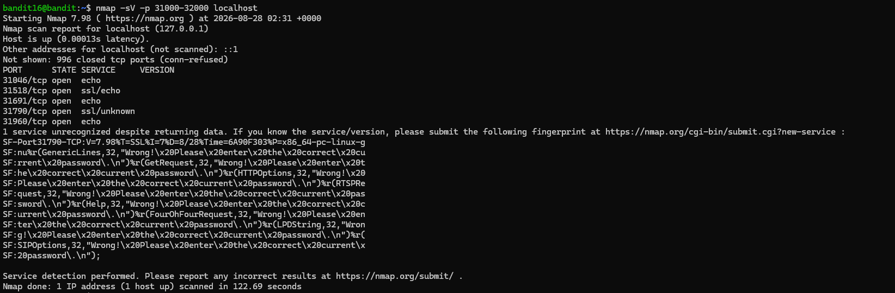
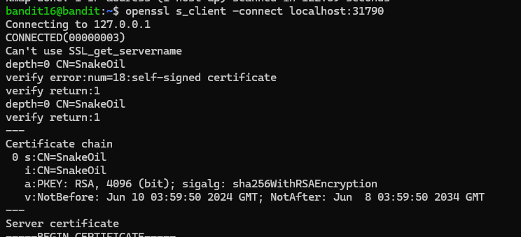
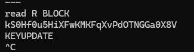
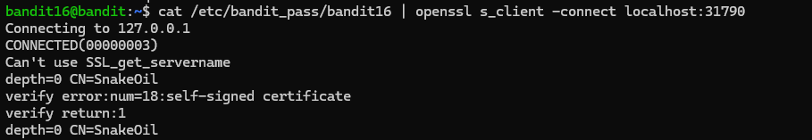
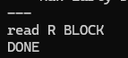
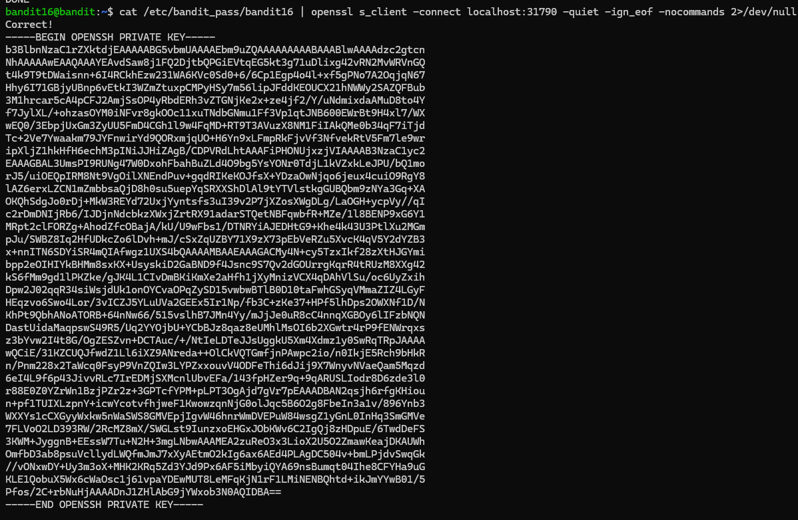
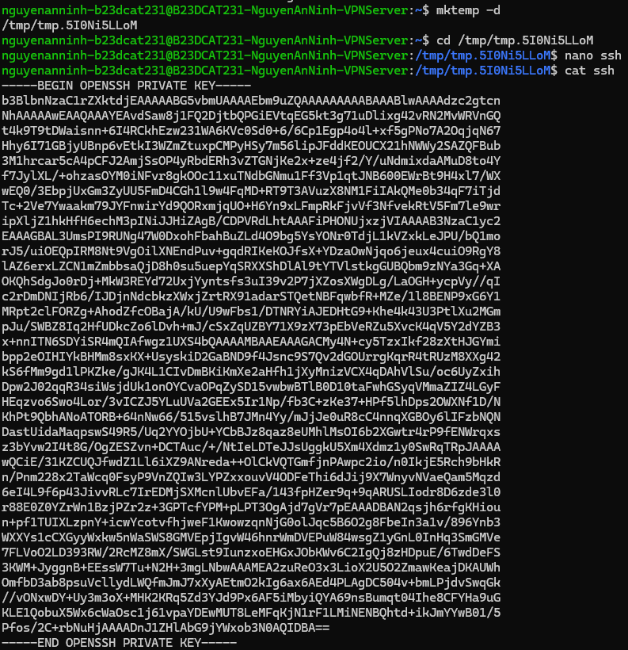
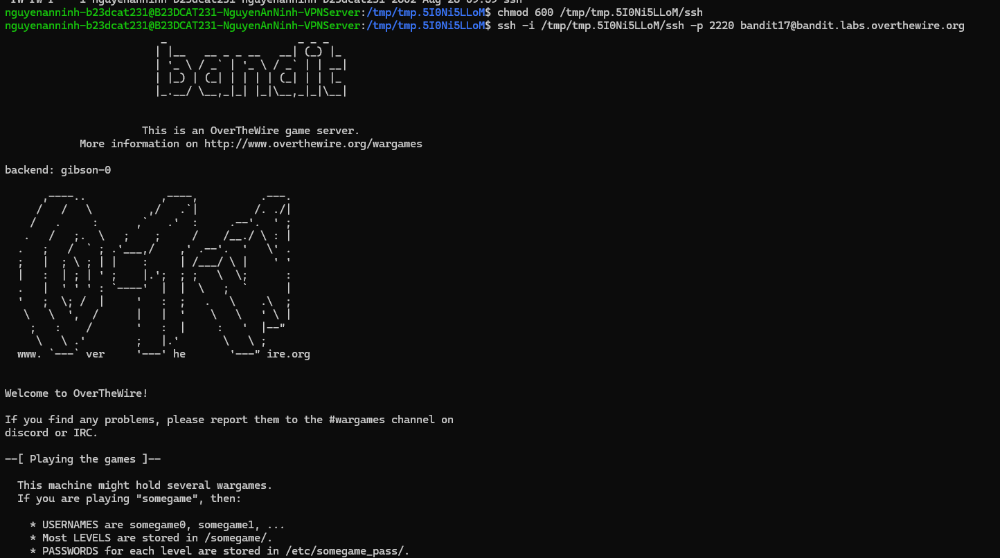

# Level 17

### Hướng làm bài

Dùng nmap để quét các port đang mở, sử dụng options -sV để nmap đoán port có dùng TLS không, nếu thấy có thì openssl s_client vào port đó và nhập password.

### Quá trình làm

Dùng nmap -sV -p 31000-32000 localhost để quét các port, ở đây options -sV nghĩa là service version detection, nó sẽ thử kết nối đến các cổng đó để nhận diện port đó đang dùng service nào. Option -p là chỉ định port, port ở đây được chỉ định quét từ 31000 đến 32000, trên localhost. Starting Nmap 7.98 ( https://nmap.org ) at 2026-08-28 02:31 +0000 ở đây là nmap bắt đầu chạy. Phiên bản nmap là 7.98, 2026-08-28 02:31 +0000 là thời gian bắt đầu quét theo UTC +0000. Nmap scan report for localhost (127.0.0.1) nghĩa là nmap đang báo kết quả scan cho localhost, 127.0.0.1 là localhost được chuyển thành ip. Host is up (0.00013s latency) nghĩa là máy host đang hoạt động, độ trễ quét là 0.00013s. Other addresses for localhost (not scanned): ::1 nghĩa là địa chỉ khác của host, không được scan, nó là địa chỉ IPv6 ::1. Not shown: 996 closed tcp ports (conn-refused) nghĩa là không hiện ra 996 cổng vì nó bị đóng, khi nmap kết nối tới thì bị báo từ chối. PORT STATE SERVICE VERSION là các tiêu đề của bảng kết quả lần lượt là số port, trạng thái, dịch vụ và phiên bản. Ở đây các port quét được đều open, có 3 kiểu dịch vụ quét được là echo (trả lại đúng thứ mình nhập vào), ssl/echo (có kết nối ssl/tls nhưng cũng chỉ trả về những thứ mình nhập vào) và ssl/unknown (nmap biết nó dùng ssl/tls nhưng không biết nó sử dụng dịch vụ gì). Ta dễ dàng thấy đây là port đáng nghi nhất, nên sẽ thử kết nối vào port này. 1 service unrecognized despite returning data. If you know the service/version, please submit the following fingerprint at ... Đoạn này nghĩa là nmap đã thử kết nối với một port nhưng không nhận ra được dịch vụ gì, ở đây chính là port 31790. Nó còn nói nếu biết là dịch vụ gì hãy gửi fingerprint bên dưới vào web chỉ định.

SF-Port31790-TCP:V=7.98%T=SSL%I=7%D=8/28%Time=... đây là dòng mà nmap tạo fingerprint cho service lạ, ở đây nó báo port là 31790, phiên bản 7.98, dùng SSL. Các dòng (GenericLines,32,"Wrong!\x20Please\x20enter\x20the\x20correct\x20current\x20password.\ n"),... ở đây là nmap thử gửi các loại dữ liệu phổ biến như genericlines,httpoptions, get request,... để xem server phản hồi như nào. Ở đây ta thấy phản hồi là Wrong! Please enter the correct current password, nghĩa là nó không phải echo thường, nó có kiểm tra password (x\20 là kí diệu hex của dấu cách).

Kết nối đến port 31790 bằng openssl s_client.

Sau đoạn read R BLOCK là server đợi nhận dữ liệu. Ta nhập password và thấy server trả về chữ KEYUPDATE vì ở đây password bắt đầu bằng chữ k, khi ta kết nối bằng openssl s_client thì có một số connected command và nó sẽ nhận diện chữ k là lệnh KEYUPDATE, tương tự nếu là R thì là RENEGOTIATING, Q là done/quit. Ở đây em Ctrl+C để thoát khỏi kết nối luôn.

Ở đây thử dùng pipe để nhập password vào nhưng output hiện DONE. Có thể là do cat gửi password xong rồi đóng luồng nhập nên openssl cũng tự kết thúc phiên làm việc.

Ở đây ta dùng lệnh cat /etc/bandit_pass/bandit16 | openssl s_client -connect localhost:31790 -quiet -ign_eof -nocommands 2>/dev/null. Thêm option -quiet để bỏ bớt những output rác, option -ign_eof là ignore end of file, nó bảo với openssl khi cat gửi xong password thì đừng đóng kết nối, để nó không hiện DONE nữa, -nocommands là option không sử dụng connected command để tránh nhận diện các chữ đầu password thành command. Output ta thấy hiện ra SSH private key.

> các state nmap trả về: open (port mở, không có service có lắng nghe), closed( port đóng, máy vẫn phản hồi nhưng phản hồi là không có

Ta tạo 1 thư mục tạm bằng mktemp -d. Nhảy vào thư mục đó và dùng lệnh nano ssh để tạo file ssh, lưu key vào. Dùng lệnh cat ssh thử file đó để đọc dữ liệu và kiểm tra lại.

Exit ra ngoài và đổi quyền cho file private key sang 600. Dùng lệnh ssh với option -i để đăng nhập bằng private key, tiếp theo để đường dẫn file chứa private key vào, chỉ định port và các trường khác như bình thường. Output hiện kết nối thành công.

> Các state nmap trả về: open (port mở, có service lắng nghe), closed( port đóng, không có service nào lắng nghe dù vẫn phản hồi), filtered (không biết mở hay đóng, vì một vài gói tin bị tường lửa lọc hoặc bị mất ), unfiltered (port truy cập được, nhưng không biết mở hay đóng), open|filtered (nmap không phân biệt được là open hay filtered), closed|filtered (nmap không phân biệt được là closed hay filtered.

> Default scan của nmap khi không dùng sudo thì thường dùng TCP connect scan (option tương ứng là -sT), flow kết nối là SYN -> SYN/ACK -> ACK, đủ 3 bước thì port open. Khi dùng sudo thì nmap thường dùng TCP syn scan (option tương ứng là -sS), lúc này flow chỉ là gửi SYN, nhận SYN/ACK thì port open luôn, nmap sẽ gửi RST để hủy, không hoàn tất kết nối. Ta thấy nmap dùng sudo thì sẽ nhanh, ít log hơn.

> Cấu hình để ẩn version dịch vụ chống nmap scan: không thể ẩn hoàn toàn khỏi nmap, chỉ giảm được thông tin bị lộ:

- Tắt banner/version của service

- Dùng firewall chặn các port không cần public

- Bind service vào localhost

- Không dùng default port

---

[← Level 16](level-16.md) · [Mục lục](../README.md) · [Level 18 →](level-18.md)
