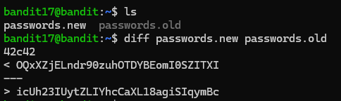
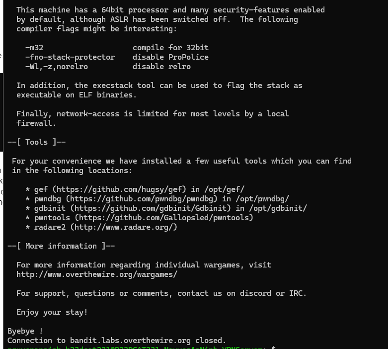

# Level 18

### Hướng làm bài

Dùng lệnh diff để xem các dòng khác nhau giữa 2 file.

### Quá trình làm

Dùng lệnh ls để xem 2 file pass cũ và mới Dùng lệnh diff passwords.new passwords.old để xem nội dung khác nhau giữa 2 file Output 42c42 nghĩa là dòng thứ 42 của file thứ nhất khác dòng 42 của file thứ 2. <... là dòng khác nhau của file thứ nhất, > …. là dòng khác nhau của file thứ 2. Ở đây ta lấy password của lv18 là đoạn sau < vì nó là thuộc file passwords.new

Đăng nhập thành công nhưng hiện ra chữ Byebye! và connection bị đóng, đề bài bảo rằng nó có liên quan tới lv18, nên ở đây password đã đúng.

---

[← Level 17](level-17.md) · [Mục lục](../README.md) · [Level 19 →](level-19.md)
