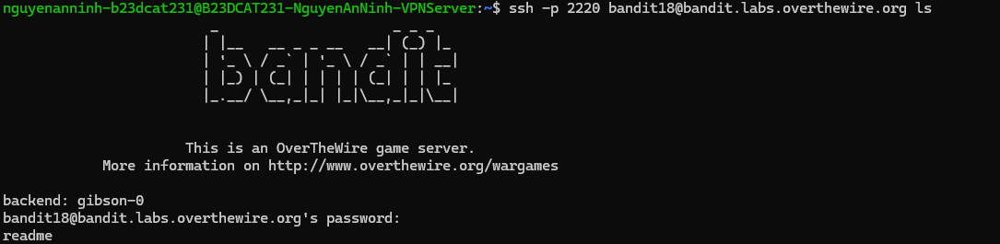
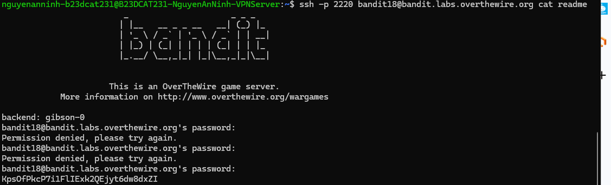
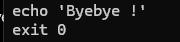
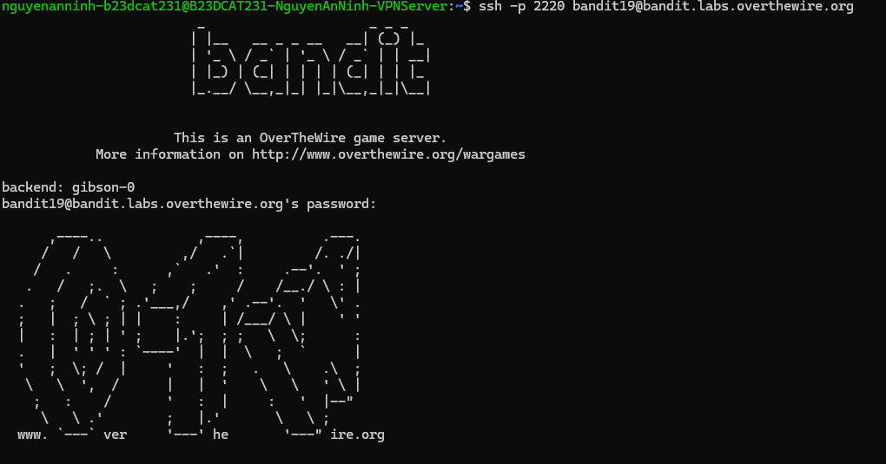
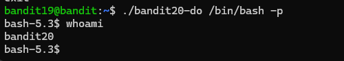

# Level 19

### Hướng làm bài

Vì .bashrc được cấu hình để ngay sau khi ssh vào lv 18 mình sẽ bị logout nên em sẽ thử chạy lệnh từ xa ngay trong câu lệnh ssh để đọc file readme, không vào shell.

### Quá trình làm

Dùng ls ngay trong ssh ta thấy trả về file readme

Dùng cat readme trong ssh ta thấy trả về password lv19

> SSH không chỉ dùng để kết nối từ xa, mà còn dùng để chạy một lệnh từ xa rồi thoát, thường thì cú pháp là ssh username@hostname “command”, nhưng nếu câu lệnh đơn giản như trên thì có thể không cần “ “ ( nên dùng khi có pipe, câu lệnh phức tạp). Ở đây ssh + command như này nó không hề truy cập vào shell, kể cả .bashrc có không đượ cấu hình để mình bị logout ngay sau khi ssh vào.

Dùng lệnh cat .bashrc thì đọc thấy ngay sau khi echo ‘Byebye !’ thì có lệnh exit 0 thoát khỏi phiên -> không phải lỗi vì 0 là thoát với trạng thái thành công, 1 là thoát với lỗi.

> biến môi trường là các biến được hđh lưu lại để biết thông tin về môi trường đang chạy, ví dụ như biến $HOME=/home/bandit19. Các biến môi trường phổ biến như HOME, USER, SHELL, PATH, PWD, OLDPWD, HOSTNAME. Ta có thể tìm biến trong các file

cấu hình như /etc/environment, /etc/profile,...

Đăng nhập thành công.

Có cách để chiếm shell là dùng /bin/bash để mở shell của lv20, cần thêm option -p là privileged mode để bash ko tự bỏ UID, nếu không có option này thì sẽ bị drop quyền do môi trường không an toàn.

---

[← Level 18](level-18.md) · [Mục lục](../README.md) · [Level 20 →](level-20.md)
