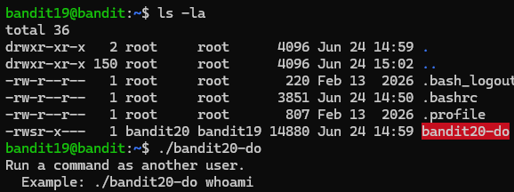
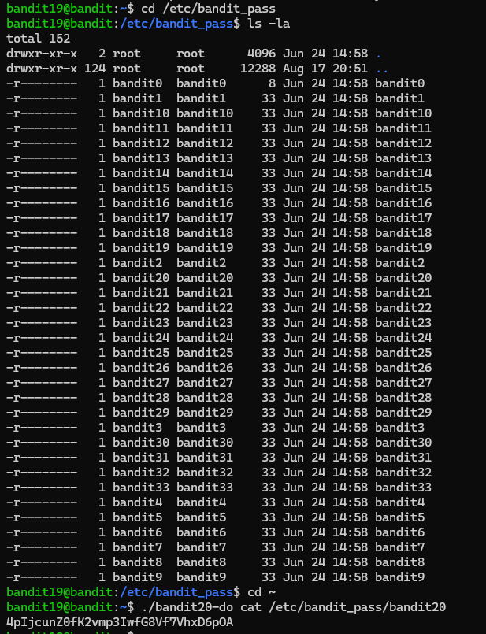
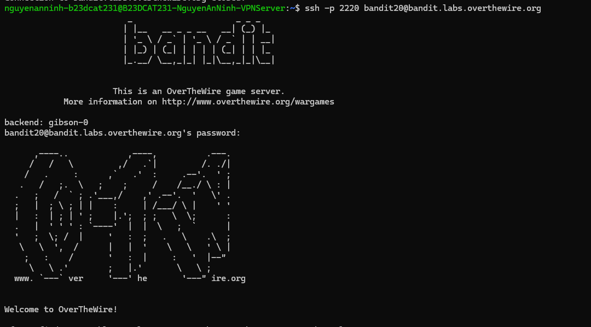

# Level 20

### Hướng làm bài

Vì đề bài bảo có một file có setuid và hãy thử chạy nó không cần tham số để xem cách sử dụng rồi sau đó sẽ cat vào /etc/bandit_pass để đọc pass của level 20.

### Quá trình làm

Dùng lệnh ls -la để xem các file có trong thư mục home, ta thấy file bandit20-do được tô đỏ, và ở quyền của owner, thay vì là rwx thì bây giờ là rws, s ở đây là file được setuid, nghĩa là khi chạy nó, nó sẽ được chạy ở quyền của owner, vì vậy dù đang là bandit19, ta vẫn có thể execute nó. Câu lệnh ./bandit20-do để chạy file này, ta thấy hướng dẫn bảo rằng: chạy một lệnh giống như một user khác, user khác ở đây bài muốn nói là bandit20.

Vào thư mục /etc/bandit_pass ta thấy các file password của từng level đều chỉ có quyền đọc từ chính user của level đó. Quay lại thư mục home bằng cd ~ , ở đây dấu ngã đại diện cho thư mục home. Dùng lệnh ./bandit20-do cat /etc/bandit_pass/bandit20 để đọc nội dung trong file bandit20, output trả về là password level 20.

> setuid không xấu, nó được dùng để cho phép user có quyền để làm một số việc cần quyền cao hơn (VD: /usr/bin/passwd được gắn setuid để user có quyền đổi mật khẩu của mình). Nhưng nếu không được dùng đúng cách hoặc chương trình lỗi có thể dẫn đến leo thang đặc quyền.

Đăng nhập vào lv20 thành công.

---

[← Level 19](level-19.md) · [Mục lục](../README.md) · [Level 21 →](level-21.md)
