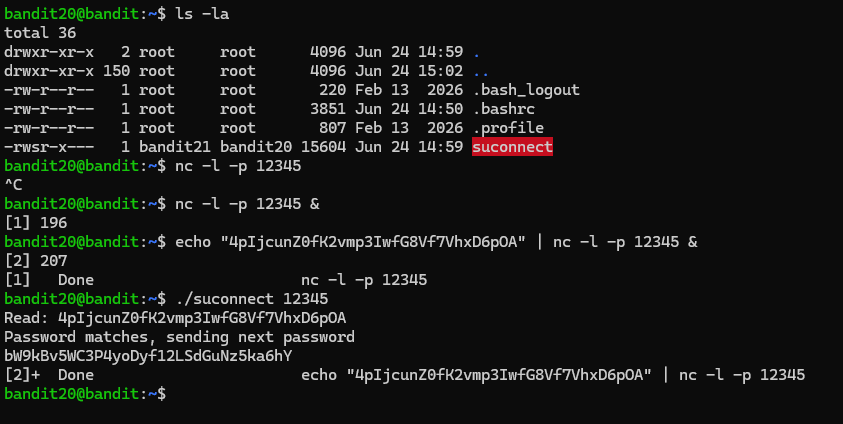
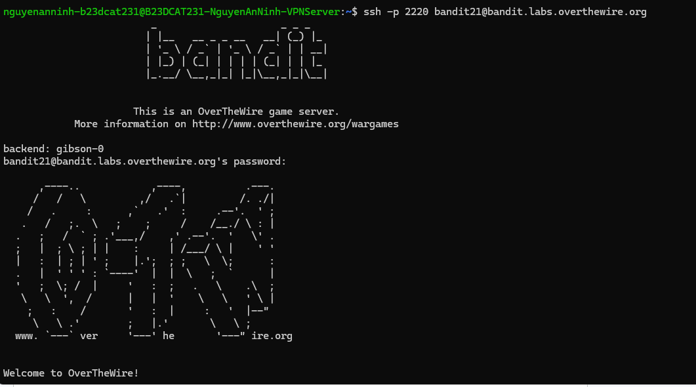

# Level 21

### Hướng làm bài

Mở một kết nối của mình tại cổng bất kì sử dụng nc, echo password lv20 vào làm stdin rồi dùng file setuid đề cho để kết nối vào cổng đó.

### Quá trình làm

Dùng lệnh ls -la để xem các file trong home dir, ta thấy file suconnect là file đề bài nói có setuid. Đầu tiên em dùng lệnh nc -l -p 12345 với -l là listen nghĩa là đợi kết nối, -p là chỉ định port, ở đây là 12345 ( trên 1024 là port là an toàn), ở đây em Ctrl C để ngắt luôn câu lệnh để thêm ‘&’, nghĩa là cho nc chạy nền, đỡ phải chuyển qua một terminal mới. Output hiện ra [1] là số thứ tự của việc này trong shell, 196 là id. Vì chưa echo password vào để làm stdin cho nc nên em dùng lệnh echo password với pipe cùng lệnh nc. Output hiện ra 2 là số thứ tự của việc này, id là 207, vì ở đây trùng port với việc 1 nên shell done luôn việc 1. Chạy file bài cho với port 12345, lúc này echo sẽ gửi dữ liệu vào làm stdin của nc, nc đóng vai trò như một trạm trung chuyển dữ liệu sang cho suconnect, suconnect nhận được password lv20. Output ta thấy suconnect đọc password của lv20, báo password matches và gửi pass của lv20. Dòng cuối báo Done để kết thúc lệnh echo … | nc …,

Đăng nhập thành công.

---

[← Level 20](level-20.md) · [Mục lục](../README.md) · [Level 22 →](level-22.md)
