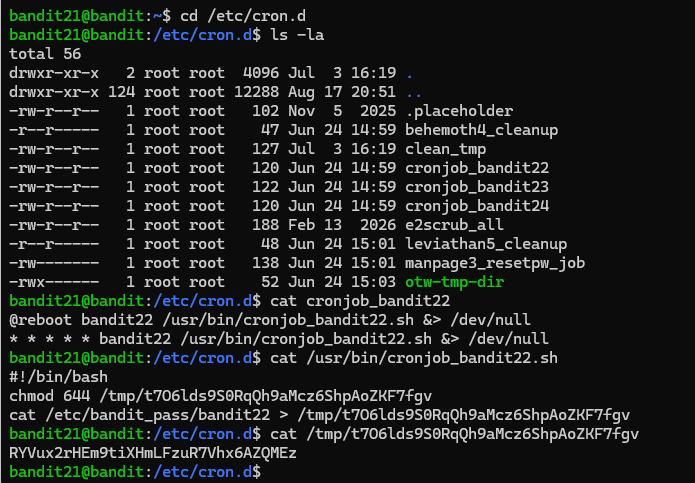
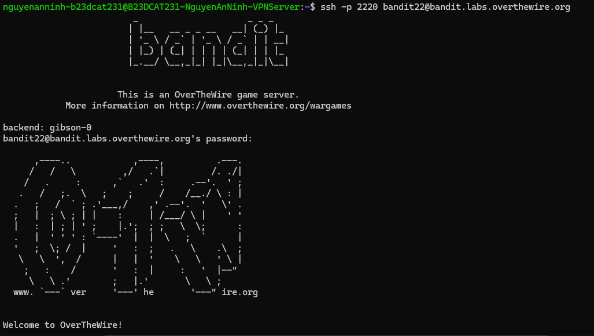
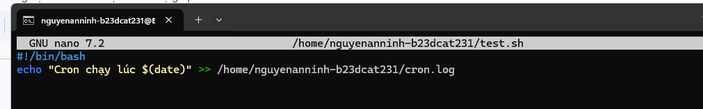
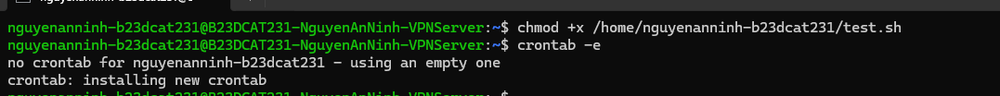
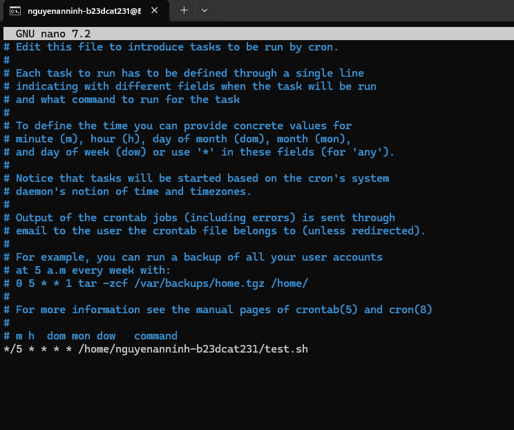
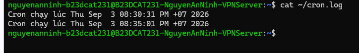
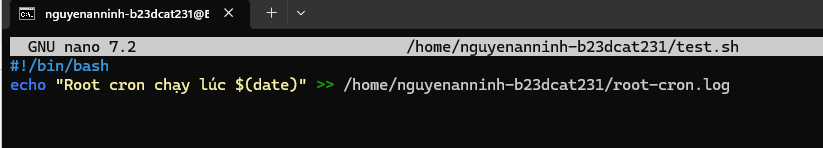
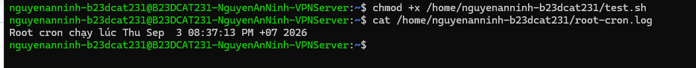
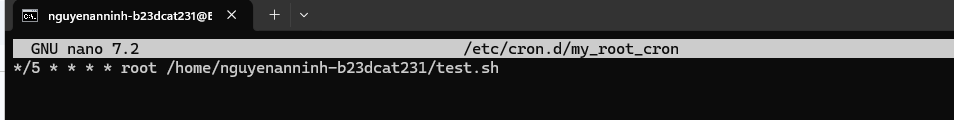
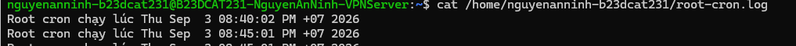

# Level 22

### Hướng làm bài

Đọc nội dung trong file cron bài cho, xem nó dùng script gì rồi đọc nội dung trong script đó.

### Quá trình làm

cd vào /etc/cron.d Dùng lệnh ls -la để xem các file hiện có trong thư mục, ta thấy có file cronjob của lv22 Dùng lệnh cat để đọc file đó. Dòng @reboot bandit22 /usr/bin/cronjob_bandit22.sh &> /dev/null nghĩa là khi hệ thống khởi động lại, script sẽ được chạy với quyền user bandit22 và ẩn toàn bộ output vì & nghĩa là cho cả 1,2 (stdout,stderr) vào dev/null. Dòng * * * * * bandit22 /usr/bin/cronjob_bandit22.sh &> /dev/null với * đầu tiên là phút, tiếp theo là giờ, ngày, tháng, thứ trong tuần. Ở đây tất cả là dấu * nghĩa là chạy mỗi phút. Dùng lệnh cat đọc script. Output ta thấy đầu tiên là dòng #!/bin/bash, nó là shebang, nó nói rằng script này được chạy bằng Bash. Dòng 2 là đổi quyền của file trong thư mục tmp. Dòng 3 là đọc nội dung của file password lv22 rồi cho vào trong file được đổi quyền bên trên, vì vậy ta chỉ cần đọc file trong thư mục tmp là có password lv22. Dùng lệnh cat đọc file ta được password.

Đăng nhập thành công Tạo 1 crontab chạy file .sh mỗi 5p

Tạo script in ra thời gian cron chạy và ghi vào file cron.log.

Cấp quyền cho file script và mở crontab -e, e ở đây là edit, nó sẽ mở crontab của user hiện tại để chỉnh sửa.

Config mỗi 5p sẽ chạy script 1 lần.

Log đầu tiên là em tự chạy script, log thứ 2 là nó auto chạy.

Tạo cron trên quyền root --> Chuyển vào file /etc/cron.d/

Vì đây là file cron ở trong /etc/cron.d/ nên phải chỉ rõ user, ở đây là root ở trong file config crontab.

> Shebang là dòng đầu tiên trong một script, thường có dạng #!/bin/bash. Nó dùng để chỉ cho hệ điều hành biết script này cần được chạy bằng chương trình nào, ví dụ Bash, python hay sh. Nếu không có shebang thì script vẫn có thể chạy được khi mình gọi rõ chương trình để chạy nó, ví dụ bash test.sh. Nhưng nếu chạy trực tiếp bằng ./test.sh, script có thể bị lỗi hoặc bị chạy bằng shell mặc định khác, dẫn đến không thực thi được, nhất là khi script dùng cú pháp riêng của Bash. Vì vậy, tốt nhất nên thêm shebang như #!/bin/bash ở đầu file để script luôn được chạy đúng cách.

---

[← Level 21](level-21.md) · [Mục lục](../README.md) · [Level 23 →](level-23.md)
