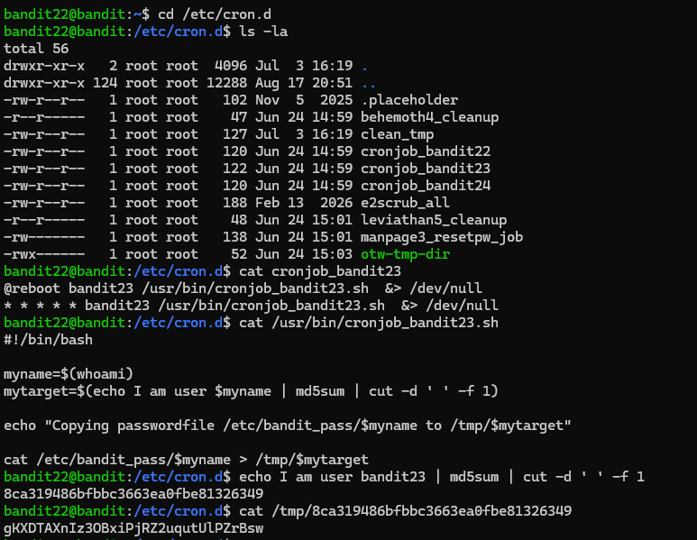
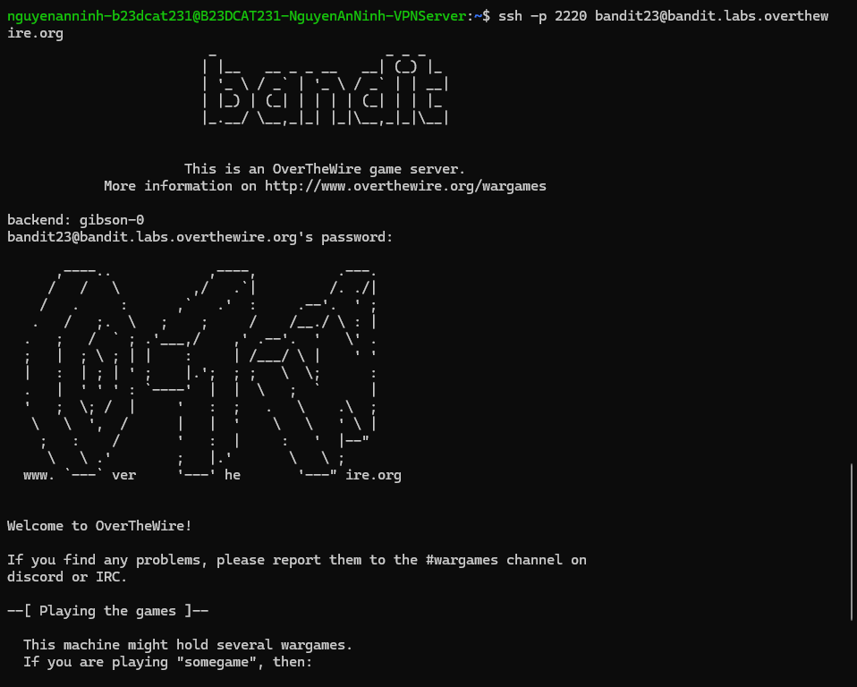

# Level 23

### Hướng làm bài

Vào đọc file script rồi thực hiện đọc và chạy thử script.

### Quá trình làm

cd vào /etc/cron.d và liệt kê các file trong thư mục. Tiến hành đọc file cronjob_bandit23. Output ta thấy dòng đầu tiên là sau khi reboot, script trong file .sh sẽ được chạy với quyền của user bandit23 và output sẽ bị ẩn đi, kể cả lỗi hay không lỗi, script sẽ được chạy mỗi phút. Tiến hành đọc script, dòng đầu tiên ta thấy script được chạy bởi bash, ta thấy script này được cron chạy dưới quyền bandit23, nên dòng myname=$(whoami) sẽ lấy ra tên user đang chạy là bandit23. Sau đó script tạo biến mytarget bằng cách lấy chuỗi "I am user bandit23", đưa qua md5sum để tạo mã hash, rồi dùng cut -d ' ' -f 1 để lấy phần hash đầu tiên làm tên file, bởi -d là cắt theo kí tự, kí tự được chỉ ra ở đây là ‘ ‘, rồi nó lấy trường đầu tiên (option -f 1). Tiếp theo, nó in ra thông báo rằng sẽ copy password từ /etc/bandit_pass/bandit23 sang /tmp/<mã hash>. Cuối cùng, dòng cat /etc/bandit_pass/$myname > /tmp/$mytarget sẽ đọc password của bandit23 và ghi vào file trong /tmp, nên mình chỉ cần tự tính đúng $mytarget rồi cat /tmp/<hash> là lấy được password.

Tính hash md5sum của dòng “echo I am user bandit23” và cut theo đúng kiểu trong script. Output ta thu được là tên file trong thư mục tmp. Đọc file đó trong /tmp ta thu được password.

Đăng nhập thành công.

---

[← Level 22](level-22.md) · [Mục lục](../README.md) · [Level 24 →](level-24.md)
