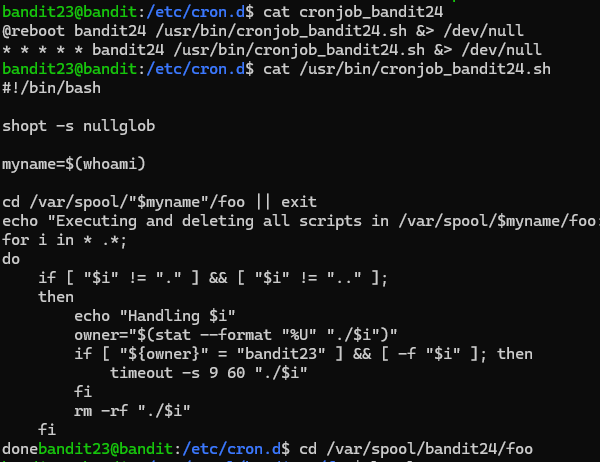
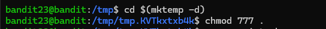
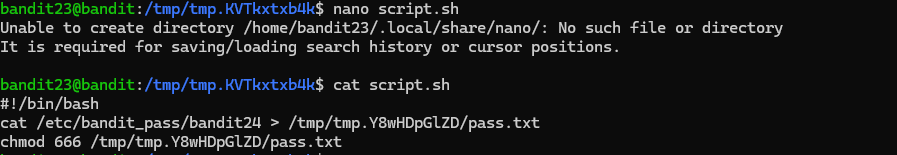
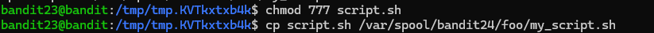
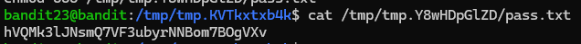
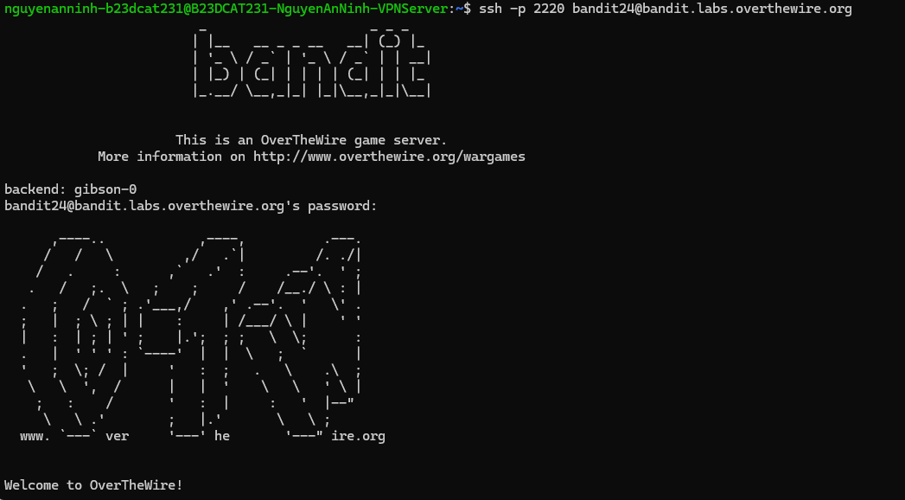

# Level 24

### Hướng làm bài

Đọc file cronjob và từ đó đọc script bên trong để làm theo và lấy password.

### Quá trình làm

Đọc file cronjob_bandit24 bằng lệnh cat. Output ta thấy Đọc file cấu hình, ta thấy cronjob được thiết lập để chạy script /usr/bin/cronjob_bandit24.sh dưới quyền của user bandit24, định kỳ 1 phút một lần và cả khi hệ thống khởi động lại, toàn bộ output đều được chuyển hướng vào /dev/null. Tiến hành đọc file script /usr/bin/cronjob_bandit24.sh.

Dòng đầu tiên #!/bin/bash là shebang chỉ định script được thực thi bằng bash shell.

Dòng tiếp theo shopt -s nullglob dùng để bật tính năng nullglob trong bash, tác dụng là nếu trong thư mục không có file nào khớp với mẫu tìm kiếm thì nó sẽ trả về danh sách rỗng thay vì giữ nguyên ký tự đại diện *, tránh việc script bị lỗi khi thư mục trống.

Dòng myname=$(whoami) sẽ lấy tên của user đang chạy script này, do cron gọi dưới quyền bandit24 nên biến myname sẽ nhận giá trị là bandit24.

Dòng cd /var/spool/"$myname"/foo || exit sẽ nhảy vào thư mục /var/spool/bandit24/foo, nếu lệnh cd bị lỗi thì || exit sẽ dừng toàn bộ script ngay lập tức.

Dòng echo "Executing and deleting all scripts in /var/spool/$myname/foo:" in ra một dòng log thông báo bắt đầu xử lý và dọn dẹp các script trong thư mục foo.

Dòng for i in * .*; do mở một vòng lặp for để duyệt qua toàn bộ các file thường (*) lẫn các file ẩn (.*) nằm trong thư mục foo, mỗi file tìm thấy sẽ được gán vào biến i.

Dòng if [ "$i" != "." ] && [ "$i" != ".." ]; then kiểm tra nếu file đang xét không phải là thư mục hiện tại . và cũng không phải thư mục cha .. thì mới xử lý tiếp, mục đích là để tránh xóa nhầm cấu trúc thư mục gốc.

Dòng echo "Handling $i" in ra tên của file đang được kiểm tra ở vòng lặp hiện tại.

Dòng owner="$(stat --format "%U" "./$i")" sử dụng lệnh stat với format %U để lấy ra tên user sở hữu file ./$i đó rồi gán vào biến owner.

Dòng if [ "${owner}" = "bandit23" ] && [ -f "$i" ]; then kiểm tra xem file đó có đúng là do bandit23 sở hữu hay không và option -f kiểm tra nó có phải là một file bình thường hay không.

Dòng timeout -s 9 60 "./$i" sẽ thực thi file script đó dưới quyền của bandit24, đặt giới hạn tối đa 60 giây, nếu chạy quá 60 giây thì gửi tín hiệu signal 9 (SIGKILL) để ép dừng tiến trình.

Dòng fi kết thúc khối lệnh điều kiện kiểm tra chủ sở hữu.

Dòng rm -rf "./$i" sẽ xóa sổ file đó ngay lập tức sau khi chạy xong, option -f để bắt buộc xóa, -r là cho phép xóa cả các file nằm bên trong và chính thư mục hiện tại.

Dòng fi tiếp theo đóng khối điều kiện loại trừ . và ...

Dòng done kết thúc vòng lặp for sau khi duyệt xong toàn bộ file.

Lệnh cd $(mktemp -d) thực hiện tạo nhanh một thư mục tạm có chuỗi ký tự ngẫu nhiên nằm trong /tmp và lập tức chuyển terminal vào thư mục đó. Tên thư mục mới được sinh ra là /tmp/tmp.KVTkxtxb4k.

Lệnh chmod 777 . dùng để mở toàn bộ quyền đọc, ghi và thực thi cho thư mục hiện tại.

Lệnh nano script.sh được gõ để mở trình soạn thảo văn bản nano nhằm tạo file script.

Hệ thống in ra hai dòng cảnh báo: Unable to create directory /home/bandit23/.local/share/nano/: No such file or directory và It is required for saving/loading search history or cursor positions. Thông báo lỗi này cho biết nano không thể tạo thư mục lưu lịch sử con trỏ chuột bên trong thư mục home của bandit23 vì tài khoản bị không có quyền ghi; tuy nhiên đây chỉ là cảnh báo tính năng phụ, nội dung file script.sh gõ vào vẫn được lưu thành công vào đĩa.

Sau khi viết xong, dùng cat script.sh để kiểm tra lại nội dung bên trong.

### Output hiển thị ba dòng code

● Dòng đầu #!/bin/bash là shebang chỉ định chạy script bằng trình thông dịch bash. ● Dòng thứ hai cat /etc/bandit_pass/bandit24 > /tmp/tmp.Y8wHDpGlZD/pass.txt sẽ đọc file mật khẩu của bandit24 rồi chuyển hướng nội dung ghi đè vào file pass.txt tại đường dẫn tuyệt đối đã tạo từ trước. ● Dòng thứ ba chmod 666 /tmp/tmp.Y8wHDpGlZD/pass.txt gán quyền đọc và ghi cho toàn bộ user trên hệ thống đối với file pass.txt, đảm bảo sau khi bandit24 tạo file xong thì bandit23 vẫn đọc được.

Tiến hành cấp quyền thực thi cho script bằng lệnh chmod 777 script.sh, phải có quyền execute thì cronjob mới chạy đc script. Dùng lệnh cp script.sh /var/spool/bandit24/foo/my_script.sh để copy file vào thư mục chờ của cronjob và đổi tên thành my_script.sh.

Đợi khoảng 1 phút để cronjob tự động quét, chạy script và xóa file khỏi hàng đợi, sau đó tiến hành đọc file kết quả bằng lệnh cat /tmp/tmp.Y8wHDpGlZD/pass.txt.

Output in ra chuỗi password.

Đăng nhập thành công.

---

[← Level 23](level-23.md) · [Mục lục](../README.md) · [Level 25 →](level-25.md)
