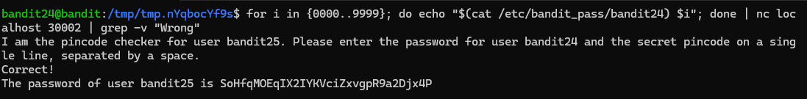
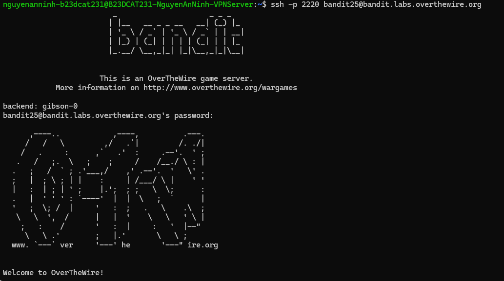

# Level 25

### Hướng làm bài

Tạo 1 script ghi các input để bruteforce mã PIN từ 0000 đến 9999 rồi sau đó truyền vào port đề bài cho để tìm ra password.

### Quá trình làm

for i in {0000..9999}; do ... ; done: Mở một vòng lặp for chạy đúng 10.000 lượt. Biến i sẽ tuần tự nhận các giá trị từ 0000 đến 9999,đúngmã PIN hệ thống yêu cầu. echo "$(cat /etc/bandit_pass/bandit24) $i": Ở mỗi lượt lặp, đoạn $(cat /etc/bandit_pass/bandit24) sẽ lấy trực tiếp mật khẩu của bandit24 đang lưu trên hệ thống. Lệnh echo sau đó sẽ in ra một chuỗi gồm mật khẩu này ghép với mã PIN hiện tại ($i), ngăn cách nhau bởi một khoảng trắng. | nc localhost 30002: lấy toàn bộ 10.000 dòng dữ liệu vừa được vòng lặp sinh ra và đẩy thẳng vào làm đầu vào nc. Netcat tiến hành mở kết nối tới cổng 30002 trên localhost và đẩy dữ liệu vào liên tục. | grep -v "Wrong": Lệnh grep kèm option -v (đảo ngược) sẽ quét từng dòng, bỏ toàn bộ những dòng chứa chữ "Wrong" (thông báo sai mã PIN). Nó chỉ cho phép in ra màn hình những dòng dữ liệu không có chữ "Wrong". I am the pincode checker for user bandit25. Please enter the password for user bandit24 and the secret pincode on a single line, separated by a space. Đây là dòng thông báo chào mừng của server ngay khi netcat thiết lập kết nối thành công. Vì dòng chữ này không chứa từ khóa "Wrong", bộ lọc grep đã giữ lại và in nó ra màn hình. Dòng: Correct! Sau khi netcat bơm dữ liệu và quét trúng mã PIN chính xác, daemon trả về thông báo xác thực thành công. Dòng này cũng lọt qua được bộ lọc grep . The password of user bandit25 is SoHfqMOEqIX2IYKVciZxvgpR9a2Djx4P Đây là kết quả cuối cùng.

Đăng nhập thành công.

---

[← Level 24](level-24.md) · [Mục lục](../README.md) · [Level 26 →](level-26.md)
