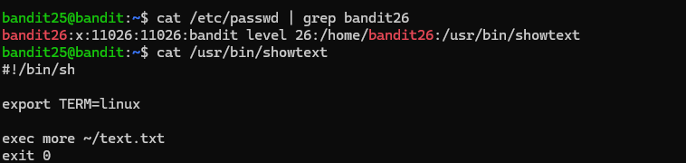
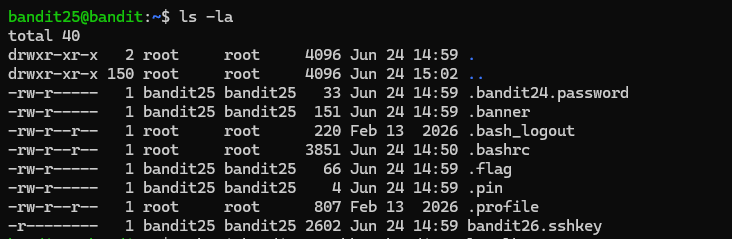
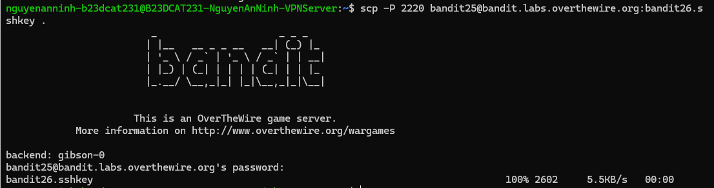
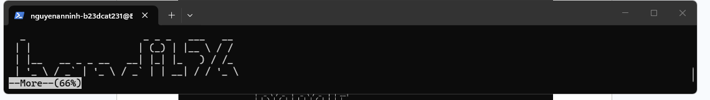
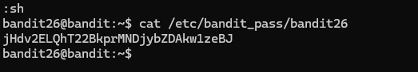

# Level 26

### Hướng làm bài

Kết nối vào bandit26 nhờ sshkey rồi thu nhỏ terminal, dùng vi để sửa shell nhờ vào lỗi của more để lấy password lv26.

### Quá trình làm

cat /etc/passwd: Lệnh này dùng để đọc toàn bộ nội dung của file /etc/passwd). grep bandit26: Hệ thống sẽ chỉ giữ lại và in ra duy nhất dòng có chứa từ khóa "bandit26". bandit26:x:11026:11026:bandit level 26:/home/bandit26:/usr/bin/showtext. Đây là toàn bộ thông tin cấu hình của user bandit26. bandit26 là tên đăng nhập của tài khoản. x: Chữ x biểu thị rằng mật khẩu thực sự của tài khoản này đã được mã hóa và cất giấu sang một file bảo mật hơn là /etc/shadow (chỉ root mới đọc được). 11026 (UID - User ID): Mã định danh độc nhất của user. Linux không quản lý phân quyền bằng tên "bandit26", mà nó xử lí mọi quyền đọc/ghi/thực thi bằng con số 11026 này. 11026 (GID - Group ID): Mã định danh nhóm chính mà user này thuộc về. /home/bandit26: Đường dẫn tới thư mục home của user. Phần mấu chốt nằm ở cột cuối cùng: /usr/bin/showtext. Nó cho biết shell mặc định của user này đã bị đổi. Thay vì được cấp /bin/bash để gõ lệnh như bình thường, hệ thống ép tài khoản này phải tự động chạy file /usr/bin/showtext ngay khi vừa kết nối SSH. cat /usr/bin/showtext: Lệnh này đọci file script vừa tìm thấy ở trên xem nó làm nhiệm vụ gì. Kết quả lệnh 2 trả về nội dung script gồm 4 dòng: #!/bin/sh: Hệ thống biết đoạn mã này chạy bằng shell. export TERM=linux: Thiết lập biến môi trường để định dạng hiển thị text cho terminal. exec more ~/text.txt: Lệnh exec ép tiến trình hiện tại chạy công cụ more để in nội dung file ~/text.txt (chính là bức tranh chữ BANDIT). Nếu màn hình to, lệnh này chạy xong trong chớp mắt. exit 0: Lệnh ngắt kết nối. Ngay khi dòng exec more... chạy xong, hệ thống đọc đến dòng này và lập tức đá văng mày ra khỏi máy chủ. Đó là lý do phải kéo cửa sổ terminal bé xuống. Việc đó khiến dòng exec more ~/text.txt bị nghẽn lại (hiện chữ --More--), ngăn không cho kịch bản chạy tiếp xuống dòng exit 0 để vào trình soạn thảo vi. Bởi vì vi được tích hợp tính năng gọi một shell con ngay bên trong giao diện của nó bằng :! hoặc :sh

Dùng ls -la thấy có file sshkey để đăng nhập.

cp file đó về máy qua scp.

ở đây ta thu nhỏ terminal để dùng lỗ hổng của more rồi bấm v để vào vi.

Sau khi vào vi, gõ :set shell = /bin/bash, bấm enter để sửa biến môi trường shell rồi :sh enter để mở shell con lúc này chạy bằng /bin/bash mà mình đã set, lúc này ta có thể cat được password của level26 như trong ảnh.

> /bin/false và /sbin/nologin đều được dùng để ngăn người dùng đăng nhập vào hệ thống Linux, nhưng cách hoạt động khác nhau. /bin/false chỉ đơn giản là một chương trình luôn trả về trạng thái thất bại (exit code 1), nên khi người dùng cố đăng nhập bằng shell này, hệ thống sẽ đóng kết nối ngay lập tức mà không đưa ra thông báo giải thích. Nó thường được dùng cho các tài khoản hệ thống hoặc tài khoản chỉ phục vụ chạy dịch vụ.

/sbin/nologin cũng chặn đăng nhập nhưng có thông báo, vì khi người dùng cố truy cập, nó có thể hiển thị một thông báo như "This account is currently not available" hoặc nội dung được cấu hình trong file /etc/nologin.txt. Vì vậy, /sbin/nologin thường được dùng cho các tài khoản người dùng bị vô hiệu hóa đăng nhập nhưng vẫn muốn thông báo lý do, còn /bin/false phù hợp hơn với các tài khoản kỹ thuật không cần tương tác trực tiếp.

---

[← Level 25](level-25.md) · [Mục lục](../README.md) · [Level 27 →](level-27.md)
