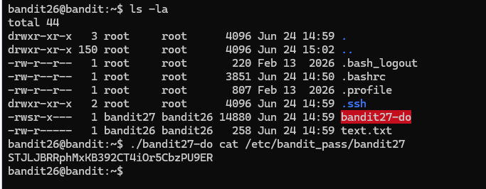
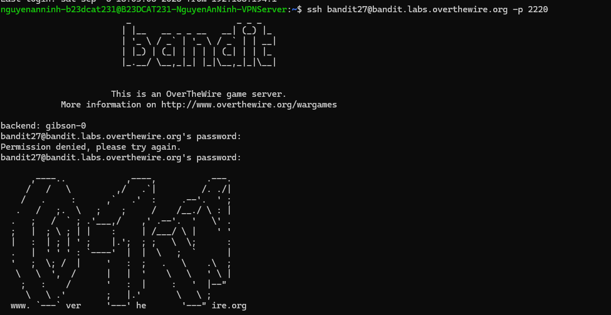

# Level 27

### Hướng làm bài

Sau khi mở được shell con ở level 26, ls -la thấy file bandit27-do được setuid nên sẽ dùng chương trình đó để đọc password level 27.

### Quá trình làm

Dùng ls -la để đọc các file hiện có ở home, ta thấy file bandit27-do được setuid. Ngoài ra còn có file .ssh để lưu các cấu hình ssh. Chạy chương trình được setuid kèm lệnh cat password lv27, ta được password.

Đăng nhập thành công.

---

[← Level 26](level-26.md) · [Mục lục](../README.md) · [Level 28 →](level-28.md)
