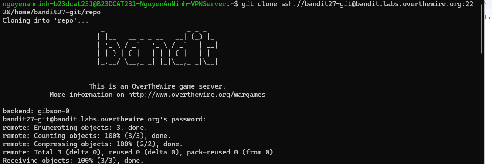
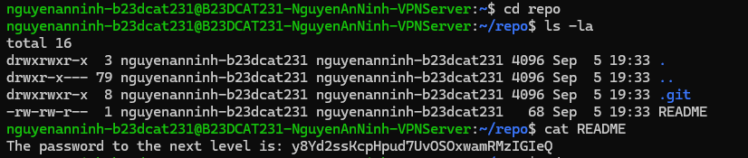
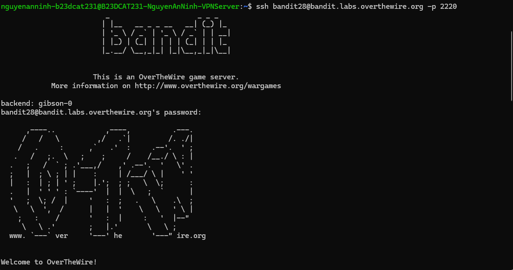

# Level 28

### Hướng làm bài

Clone git về máy mình, cd vào thư mục repo rồi tìm mật khẩu.

### Quá trình làm

git clone ssh://bandit27-git@bandit.labs.overthewire.org:2220/home/bandit27-git/repo là lệnh dùng để sao chép repository của user bandit27-git từ server bandit về máy thông qua SSH ở port 2220.

Dòng remote: Enumerating objects: 3, done. có nghĩa là Git trên server đang kiểm tra và đếm các object có trong repository để chuẩn bị gửi về.

Dòng remote: Counting objects: 100% (3/3), done. nghĩa là server đã đếm xong toàn bộ 3 object cần thiết trong repository.

Dòng remote: Compressing objects: 100% (2/2), done. nghĩa là server đã nén dữ liệu lại để quá trình truyền qua mạng nhanh và nhẹ hơn.

Dòng remote: Total 3 (delta 0), reused 0 (delta 0), pack-reused 0 cho biết tổng cộng có 3 object được gửi, không có phần dữ liệu khác biệt cần xử lý thêm và cũng không tái sử dụng dữ liệu cũ.

Dòng Receiving objects: 100% (3/3), done. nghĩa là máy đã nhận đầy đủ dữ liệu từ repository và quá trình git clone đã hoàn tất thành công.

Sau khi git clone thành công, cd vào thư mục repo. Dùng lệnh ls -la để xem các file có trong thư mục, ta thấy file README. File .git là file ẩn chứa các thông tin git cần để quản lí repo. cat file README ta thu được password.

Đăng nhập thành công.

---

[← Level 27](level-27.md) · [Mục lục](../README.md) · [Level 29 →](level-29.md)
