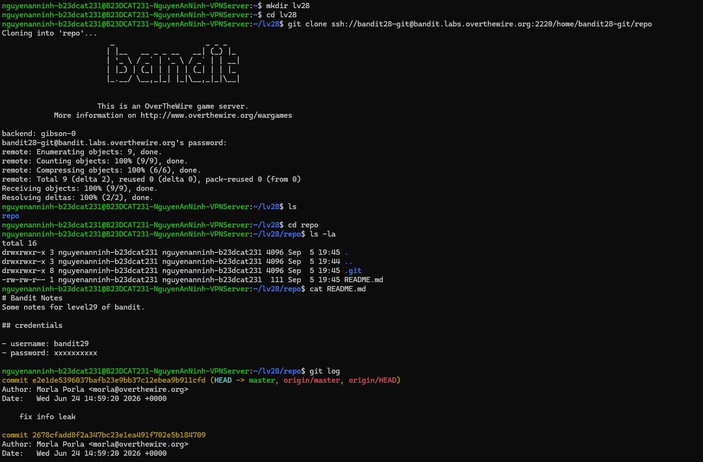
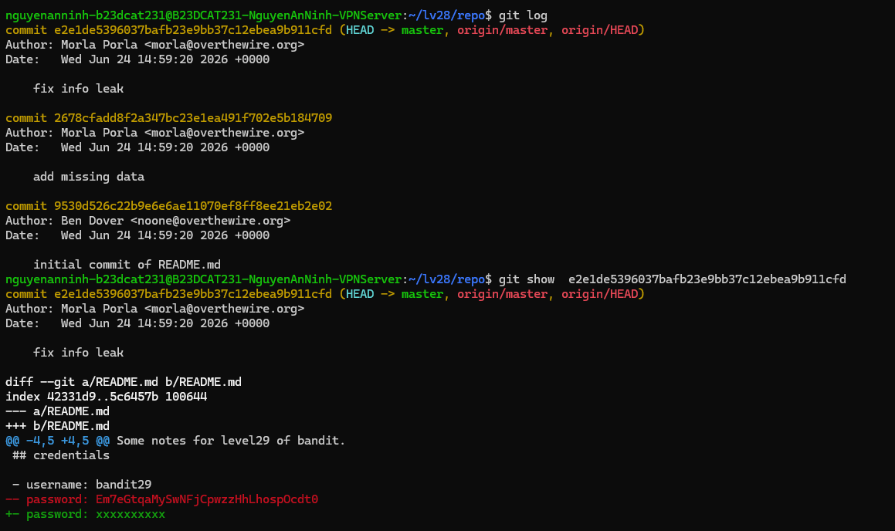
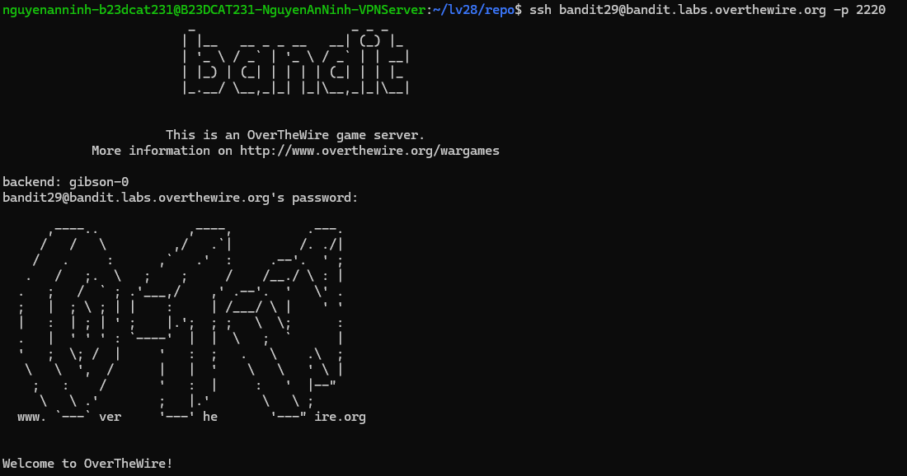

# Level 29

### Hướng làm bài

Clone git về Clone git về máy mình, cd vào thư mục repo rồi tìm mật khẩu.

### Quá trình làm

cat README.md dùng để đọc nội dung file README.md.

Trong ảnh, ta thấy phần credentials có username: bandit29 nhưng dòng password đã bị thay thành xxxxxxxxxx, nghĩa là mật khẩu thật không còn trong phiên bản hiện tại -> cần đọc log vì có thể nội dung mk vẫn còn trong các bản commit cũ.

git log là lệnh dùng để xem toàn bộ lịch sử commit của repository, tức là xem trước đây repo này đã được chỉnh sửa và lưu lại những phiên bản nào.

Dòng commit 2ee1de... cho biết đây là một commit, còn chuỗi dài phía sau là mã định danh riêng của commit đó, giống như ID để Git biết chính xác là phiên bản nào.

Phần (HEAD -> master, origin/master, origin/HEAD) cho biết commit này hiện đang là commit mới nhất. HEAD có thể hiểu đơn giản là vị trí hiện tại trong lịch sử Git. master là tên branch hiện tại, tức là nhánh chính mà repository này đang sử dụng. origin/master là branch master trên repository gốc đã clone từ server Bandit về. origin/HEAD cho biết branch mặc định của repository trên server hiện đang trỏ vào master.

Dòng Author: Morla Porla <morla@overthewire.org> cho biết người đã tạo commit này là Morla Porla, còn phần trong dấu < > là email được lưu kèm với commit.

Dòng Date: Wed Jun 24 14:59:20 2026 +0000 cho biết thời điểm commit này được tạo: ngày 24/06/2026 lúc 14:59:20 theo múi giờ UTC.

Dòng fix info leak là lời mô tả của commit, là sửa lỗi rò rỉ thông tin, đây là một gợi ý rằng trước commit này có thể đã có thông tin nhạy cảm bị lộ.

Dòng commit 2678cf... là một commit cũ hơn, tức là một phiên bản của repository trước commit fix info leak.

Dòng add missing data nghĩa là “thêm dữ liệu còn thiếu”, nên có khả năng ở commit này người tạo repository đã thêm password vào file.

Dòng commit 9530d526... là commit cũ nhất trong danh sách đang thấy.

Dòng initial commit of README.md nghĩa là đây là commit đầu tiên tạo file README.md.

Khi chạy git show 2ee1de..., Git sẽ hiển thị chi tiết những thay đổi đã xảy ra trong commit fix info leak.

Dòng diff --git a/README.md b/README.md nghĩa là Git đang so sánh file README.md trước và sau khi commit này được thực hiện. a/README.md là phiên bản cũ của file trước khi sửa. b/README.md là phiên bản mới của file sau khi sửa.

Dòng --- a/README.md tiếp tục cho biết phần bên dưới sẽ liên quan đến nội dung cũ của file.

Dòng +++ b/README.md cho biết phần bên dưới sẽ thể hiện nội dung mới sau khi file được chỉnh sửa.

Dòng bắt đầu bằng dấu - màu đỏ có nghĩa là dòng này đã bị xóa khỏi file trong commit đó.

Dòng bắt đầu bằng dấu + màu xanh có nghĩa là dòng này đã được thêm mới vào file trong commit đó.

Dòng - password: ... màu đỏ nghĩa là trước khi commit fix info leak xảy ra, file README.md từng chứa password thật.

Dòng + password: xxxxxxxxxx màu xanh nghĩa là người tạo repo đã thay password thật bằng xxxxxxxxxx để che nó đi.

Vì Git vẫn lưu lịch sử thay đổi, nên mặc dù password đã bị xóa khỏi phiên bản hiện tại, ta vẫn có thể nhìn thấy nó trong commit cũ bằng git show, password của bandit29 chính là chuỗi nằm sau password: ở dòng màu đỏ có dấu -.

Đăng nhập thành công.

---

[← Level 28](level-28.md) · [Mục lục](../README.md) · [Level 30 →](level-30.md)
