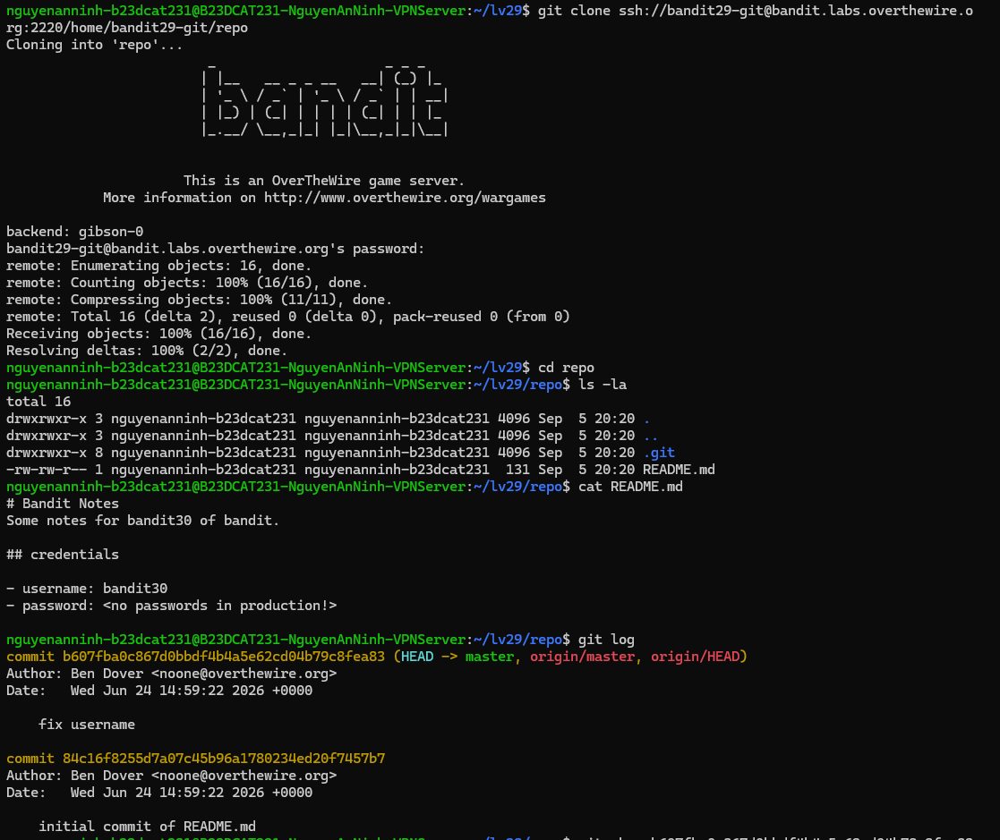
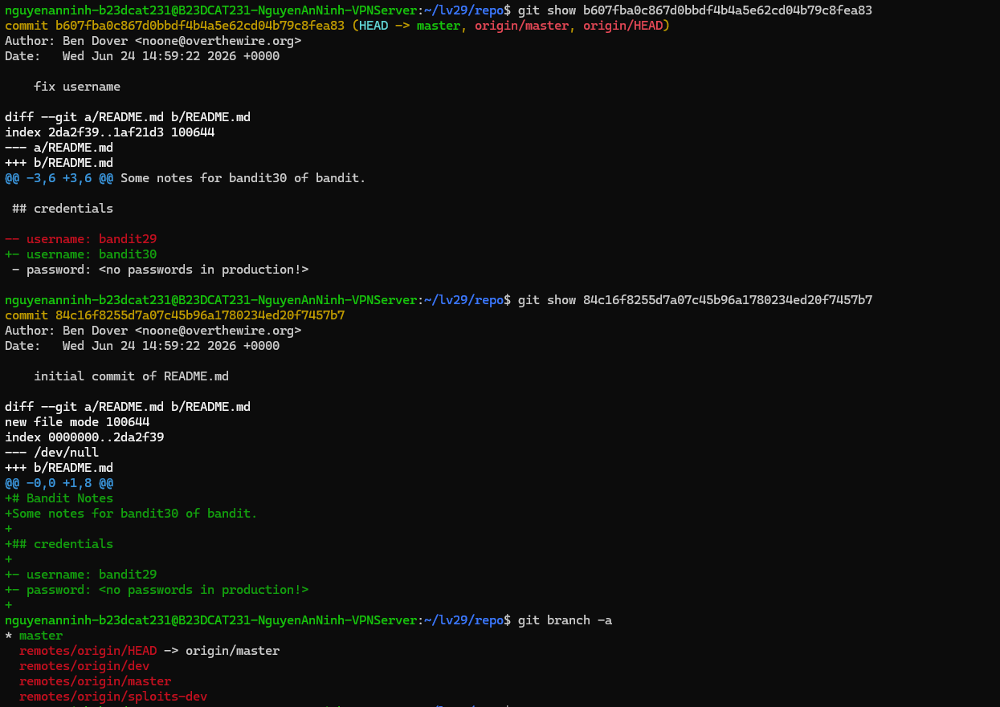
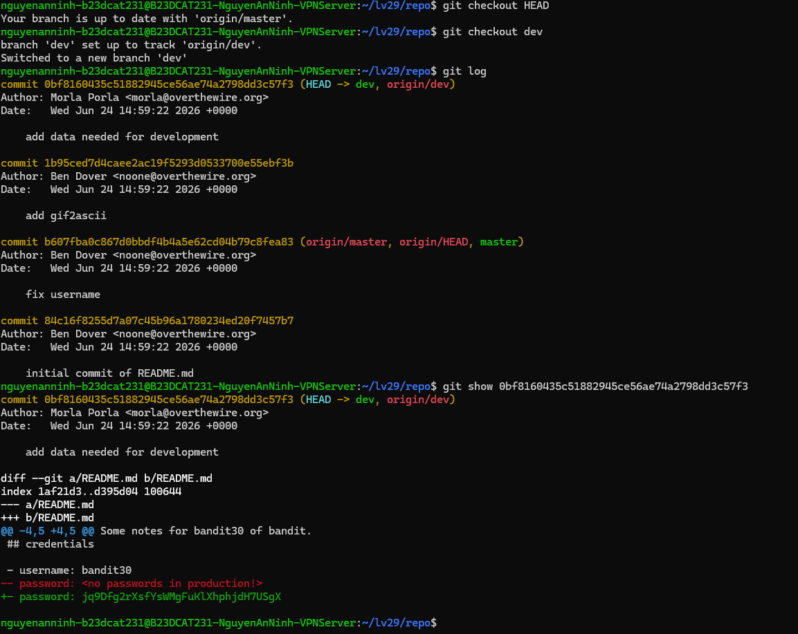
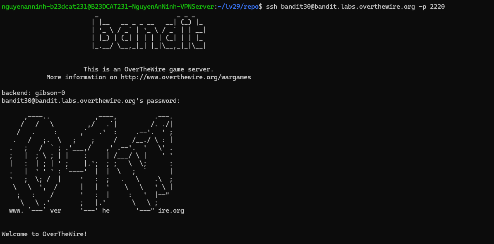

# Level 30

### Hướng làm bài

Clone git về và check git log, check các branch để tìm password.

### Quá trình làm

Ta thấy file README hiện tại không có thông tin password.

Dùng git show để show từng commit một. Ta thấy 2 lần commit này không có thông tin của mật khẩu. git branch -a là lệnh dùng để xem danh sách tất cả các nhánh có trong repo -a là viết tắt của --all, nghĩa là hiển thị tất cả branch bao gồm cả branch trên máy của ta và branch trên server.

- master cho biết branch hiện tại mà ta đang đứng là master. Dấu * phía trước có nghĩa là Git đang đánh dấu nhánh hiện tại.

remotes/origin/HEAD -> origin/master cho biết server đang dùng branch master làm branch chính, nó chỉ là thông tin tham chiếu đến branch master trên server.

remotes/origin/dev cho biết trên server có một branch tên là dev, ta cần kiểm tra branch này vì password có thể đã được để ở đây.

remotes/origin/master cho biết branch master của repo. Đây là branch chính mà ta đã clone về ban đầu. Hiện tại branch master trên máy ta đang liên kết với branch này.

remotes/origin/sploits-dev cho biết trên server còn có một branch khác tên là sploits-dev.

Your branch is up to date with 'origin/master'. có nghĩa là branch hiện tại của ta đang đồng bộ với branch master trên server. origin/master là bản tham chiếu tới branch master của repo gốc.

git checkout dev là lệnh dùng để chuyển sang branch có tên là dev. Trước đó ta đang ở branch master, sau lệnh này Git sẽ chuyển môi trường làm việc của ta sang branch dev.

branch 'dev' set up to track 'origin/dev'. nghĩa là Git tạo một branch local tên dev và liên kết nó với branch origin/dev trên server.

Switched to a new branch 'dev'. nghĩa là ta đã chuyển thành công sang branch mới tên dev.

Dùng git log để xem lịch sử commit. Output ta thấy 4 commit.

Check lần lượt từng commit, ở commit đầu tiên, ta thấy password được thêm vào.

Đăng nhập thành công.

---

[← Level 29](level-29.md) · [Mục lục](../README.md)
